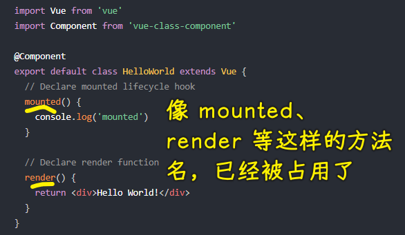

### ✍️ Tangxt ⏳ 2021-07-26 🏷️ Vue

# 06-2-使用 TS 开发 Vue 项目

## ★环境说明

### <mark>1）如何让 Vue 项目支持 TS？</mark>

在 Vue 项目中启用 TS 支持，有两种姿势：

1. 全新项目：使用 Vue CLI 脚手架工具创建 Vue 项目，在这个过程里边，我们在选择功能特性时，勾选了「TypeScript」，Vue CLI 会自动为我们配置 TS，总之，我们直接**开箱即用**即可，无须做额外的操作！
2. 已有项目：自己去添加 Vue 官方配置的 TS 适配插件 -> 使用 Vue CLI 安装 TS 插件：`vue add @vue/typescript` -> **后天支持**

### <mark>2）关于编辑器的选择</mark>

- VS Code：强烈建议使用它，因为 TS 是微软的，VS Code 也是微软的，该编辑器为 TS 提供了极好的「开箱即用」支持 -> 如果你正在使用单文件组件（SFC），那么你可以安装提供 SFC 支持以及其他更多实用功能的 Vetur 插件
- WebStorm：直接为 TS 和 Vue 提供了「开箱即用」的支持，但这个软件就是太大了！

➹：[Vue 项目添加 TypeScript 支持 - SegmentFault 思否](https://segmentfault.com/a/1190000021369683)

➹：[让 vue 老项目支持 js 与 ts 混用 - Mikasa](https://onlymisaky.gitee.io/2019/12/27/#%E5%8A%A8%E6%9C%BA)

## ★相关配置介绍

### <mark>1）安装了 TS 相关的依赖项</mark>

> 我们要知道这些与 TS 相关的依赖项的作用是什么

💡：`dependencies` 依赖


- `vue-class-component`：提供了使用 Class 语法来写 Vue 组件
- `vue-property-decorator`：在 Class 语法基础之上提供了一些辅助装饰器，说白了，它是一个增强了 Class 描述组件的工具

💡：`devDependencies`依赖


- `@typescript-eslint/eslint-plugin`：使用 ESLint 这个工具来校验 TS 代码，TS 其实有一个自己的校验工具 TSLint，但是就是不太好用，而目前大多数开发者都是用这个 ESLint 来校验 TS，而之所以能校验是因为用了这个插件
- `@typescript-eslint/parser`：`parser`也是`typescript-eslint`这个插件旗下的包，其作用就是把 TS 转化为 AST 以供 ESLint 校验使用，为啥`eslint-plugin`能校验 TS 代码，就是因为`parser`转化了 TS 代码为 AST
- `@vue/cli-plugin-typescript`：Vue CLI 的插件，它把与 TS 相关的一些配置集成起来，其核心就是使用「`typescript+ts-loader+fork-ts-checker-webpack-plugin`」来进行更快的类型检查，总之，它是一个统一的集成者、调度者
- `@vue/eslint-config-typescript`：也是 Vue CLI 旗下的插件，用来兼容 ESLint 的 TS 校验规则，说白了就是给 TS 代码一些校验规则
- `typescript`：TS 本身，TS 编译器，提供了类型校验和转换 JS 功能

### <mark>2）TS 配置文件`tsconfig.json`</mark>

启用了 TS 支持，除了安装了一些新的依赖以外，还添加了一个 TS 配置文件：

``` json
{
  "compilerOptions": {
    "target": "esnext",
    "module": "esnext",
    "strict": true,
    "jsx": "preserve",
    "importHelpers": true,
    "moduleResolution": "node",
    "experimentalDecorators": true,
    "skipLibCheck": true,
    "esModuleInterop": true,
    "allowSyntheticDefaultImports": true,
    "sourceMap": true,
    "baseUrl": ".",
    "types": [
      "webpack-env"
    ],
    "paths": {
      "@/*": [
        "src/*"
      ]
    },
    "lib": [
      "esnext",
      "dom",
      "dom.iterable",
      "scripthost"
    ]
  },
  "include": [
    "src/**/*.ts",
    "src/**/*.tsx",
    "src/**/*.vue",
    "tests/**/*.ts",
    "tests/**/*.tsx"
  ],
  "exclude": [
    "node_modules"
  ]
}
```

可以看到，它默认就配置了一些我们「开箱即用」的功能，如果你需要自定义，那你就修改该文件即可！

### <mark>3）`shims-vue.d.ts`文件的作用</mark>


它主要用于 TS 识别 `.vue`文件模块

TS 默认不支持导入 `.vue` 模块，而这个文件则告诉 TS 导入的 `.vue`文件模块都按 `VueConstructor<vue>`类型识别处理了

总之，该文件让 TS 遇到 `.vue`模块可以正常识别和加载！

### <mark>4）`shims-tsx.d.ts`文件的作用</mark>

当你用 JSX 写组件模板，如果使用了一些`Element`成员，那么那就得声明它后再使用，不然就报错找不到，总之，如果你不用 JSX，那么你可以忽略掉这个文件！


### <mark>5）TS 模块都使用`.ts`后缀</mark>

- 入口模块：`main.ts`
- ……

用了 TS ，要写 TS 代码，那你就在`.ts`文件里边写！

## ★使用 Options APIs 定义 Vue 组件

> 在 Vue 当中如何使用 TS 来定义 Vue 组件？

文档：[TypeScript Support — Vue.js](https://vuejs.org/v2/guide/typescript.html#Basic-Usage)

### <mark>1）为啥要使用 TS 写 Vue 组件？</mark>

有两点原因：

1. 编辑器给的类型提示不严谨
2. TS 编译期间的类型验证

不严谨的提示：


运行期间才会报错：


💡：TS 姿势？


使用 TS 会在代码还未运行的时候，发现错误 -> 报错信息会在编辑器的提示、终端出现，虽然页面没有出现错误，但我们在打包上线时，终端是会出现报错信息，因为这得先走 TS 编译！

### <mark>2）使用 Options APIs</mark>

- 组件仍然可以使用以前的方式定义 -> 导出组件选项对象，或者使用 `Vue.extend()`
- 但是当我们导出的是一个普通的对象，此时 TS 是无法推断出对应的类型
- 至于 VS Code 可以推断出类型成员的原因是因为我们使用了 Vue 插件
- 这个插件明确知道我们这里导出的是一个 Vue 对象
- 所以我们必须使用`Vue.extend()`方法确保 TS 能够有正常的类型推断

``` js
import Vue from 'vue'
const Component = Vue.extend({
  // 类型推断已启用
})

const Component = {
  // 这里不会有类型推断，
  // 因为 TypeScript 不能确认这是 Vue 组件的选项
}
```

为什么 TS 配合 Vue 2 的基本用法要用`Vue.extend({})`？ -> 因为要启用类型推断啊！

## ★使用 Class APIs 定义 Vue 组件

### <mark>1）官方示例</mark>

在 TS 下，Vue 的组件（`Button`）可以使用一个继承自 `Vue` 类型的子类表示，这种类型（`Button`）需要使用 `Component` 装饰器去修饰

装饰器函数接收的参数就是以前的组件选项对象，如`data、props、methods`之类的

``` ts
import Vue from 'vue'
import Component from 'vue-class-component'

// @Component 修饰符注明了此类为一个 Vue 组件
@Component({
  // 所有的组件选项都可以放在这里
  template: '<button @click="onClick">Click!</button>'
})
export default class MyComponent extends Vue {
  // 初始数据可以直接声明为实例的 property
  message: string = 'Hello!'

  // 组件方法也可以直接声明为实例的方法
  onClick (): void {
    window.alert(this.message)
  }
}
```

### <mark>2）测试示例</mark>


`test`方法是`App`这个实例的成员方法，可不是原型方法……


目前，我们已经知道了如何添加`data`和`methods`，可其它选项（计算属性、生命周期钩子 Hooks 等）该如何添加呢？

文档：[Overview - Vue Class Component](https://class-component.vuejs.org/)

`Class APIs`写法上有所不同，但本质与`Options APIs`姿势是一样的！ -> 写法上 Class 姿势有些变得简单（如写`methods`），有些变得复杂（如写`props`）！ -> 总之，还是那句话，**没有谁比谁更好，你喜欢哪种写法就用哪种写法**！

注意：

- Hooks 方法与`methos`方法是平级的，即你的方法名不能叫`created`等这样的



- Additional Hooks：钩子需要注册后才能使用，如 router hooks 

## ★关于装饰器语法

装饰器是 ES 草案中的一个新特性，它还没有发布，不过这个草案最近有可能发生重大调整，所以不建议在生产环境中使用

用装饰器姿势，让一个类有静态成员：


装饰器的作用：扩展类的功能

目前装饰器这个语法，还有很大的变动，建议等它完全稳定且发布后，你再把它用到生产环境中去！

了解更多：

- [30. Decorator - 《阮一峰 ECMAScript 6 (ES6) 标准入门教程 第三版》 - 书栈网 · BookStack](https://www.bookstack.cn/read/es6-3rd/docs-decorator.md) 
- [装饰器 · TypeScript 中文网 · TypeScript——JavaScript 的超集](https://www.tslang.cn/docs/handbook/decorators.html)
- [ TS 装饰器 - Fynn's Blog ](https://fynn90.github.io/2021/01/15/TS%E8%A3%85%E9%A5%B0%E5%99%A8/)

## ★使用 VuePropertyDecorator 创建 Vue 组件

### <mark>1）为什么需要 VuePropertyDecorator？</mark>

描述`props`数据是这样的：


这种写法比普通写法要变得更麻烦

所以 Vue 社区又做了一个叫「VuePropertyDecorator」的东西！

这个东西就是利用了装饰器的一个特点简化了我们的写法

### <mark>2）示例</mark>

文档：[kaorun343/vue-property-decorator: Vue.js and Property Decorator](https://github.com/kaorun343/vue-property-decorator)

``` ts
import { Vue, Component, Prop } from 'vue-property-decorator'

@Component
export default class YourComponent extends Vue {
  @Prop(Number) readonly propA: number | undefined
  @Prop({ default: 'default value' }) readonly propB!: string
  @Prop([String, Boolean]) readonly propC: string | boolean | undefined
}
```

我们不需要安装它，我们用 Vue CLI 创建的项目就已经自动安装它了！

它是基于 vue-class-component 之上做了一些扩展，说白了它就是提供了一些快捷的常用装饰器，让我们写起来更方便：


关于这个库是否使用？ -> 老师建议了解即可，因为这用到了装饰器语法，这种语法很有可能会变化，建议装饰器语法正式发布后，再使用，毕竟这个库还会再升级啊！

## ★总结创建组件的方式

使用 TS 以后，创建组件的三种方式：

1. Options APIs -> `Vue.extend({ ... })` -> 类型推断校验
2. Class APIs -> `@component + extends Vue`
3. Class APIs + decorator -> 增加了很多额外的辅助装饰器，如`@Prop`

问题来了，我们到底选择哪种方式？

老师个人建议：No Class APIs，只用 Options APIs

为啥这样建议？

1. Class 语法仅仅是一种写法而已，最终还是要转换为普通的组件数据结构
2. Options APIs 的学习成本基本没有 -> 偶尔需要定义一些类型，仅此而已
3. 装饰器语法还没有正式定稿发布，建议了解即可，正式发布以后再选择使用也是没有问题的！

当然，这仅仅是一个建议而已，如果你更喜欢用 Class APIs，那也是 ok 的！

注意：使用 Options APIs 最好使用`export defalut Vue.extend({ ... })`，而不是`export defalut { ... }`，因为后者不能使用 TS 一些相关的功能特性
