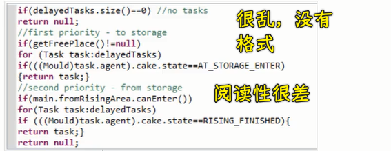

### ✍️ Tangxt ⏳ 2021-07-26 🏷️ vue

# 06-3-代码格式规范

主要说明以下几点：

- 代码格式规范介绍
- 我们项目中配置的具体代码规范是什么
- 遇到代码格式规范错误怎么办
- 如何自定义代码格式校验规范，以此来达到我们想要的需求

## ★介绍

1）为什么需要代码格式规范？

新手写的代码：

> 阅读、维护 -> 差

有经验的同学写的代码：

良好的代码格式规范更有利于：

* 更好的多⼈协作
* 更好的阅读
* 更好的维护
* 降低我们代码出错的几率
* ……

达成良好的共识，是非常有必要的！

2）标准是什么？

代码规范是有好处的，可什么是规范呢？换言之，我们应该用什么样的格式来写代码呢？ -> 标准是啥？

**没有绝对的标准**，下⾯是⼀些⼤⼚商根据多数开发者的编码习惯制定的⼀些编码规范，仅供参考。
  
* [JavaScript Standard Style](https://standardjs.com/) -> 它的名字就叫做「标准风格」，但并不是真正的标准
* [Airbnb JavaScript Style Guide](https://github.com/airbnb/javascript)
* [Google JavaScript Style Guide](https://google.github.io/styleguide/jsguide.html)

> 在前端里边，编码规范不仅仅是 JS 有，HTML、CSS、Vue、React 等都有

💡：JavaScript Standard Style？

💡：Airbnb JavaScript Style Guide

air 前端团队制定的，规则更细致，而「JavaScript Standard Style」只是把最需要的规范规定了一下而已，比较简单！

💡：Google JavaScript Style Guide

谷歌内部制定的编码规范

3）选择哪个？

一看公司，二看个人喜好 -> 没有绝对的好与错

老师建议：

- 个人使用（少的团队，不超过 3 人）：JavaScript Standard Style -> 规则没那么严谨，没有那么多琐碎的细节，只是把通用的规范制定了一下！ 而像「Airbnb JavaScript Style Guide、Google JavaScript Style Guide」这样的，就比较严格，适合大型团队使用

标准只是作为一个规范的参考，那问题来了，我们如何在项目中约束代码规范呢？

4）如何让他人都遵守代码规范？

团队协作开发，只靠⼝头约定肯定是不⾏的，所以要**利⽤⼯具来强制执⾏，让你没办法去犯错**

> 张三遵守约定，而李四则不遵守，结果最终合作写出来的代码是乱七八糟的！

* [JSLint](https://jslint.com/)
* [JSHint](https://jshint.com/)
* [ESLint](https://cn.eslint.org/) -> 目前用的，也是用的最多的，上边两个已经被淘汰了！
* ...

这些都是代码格式校验工具

我们之前用 Vue CLI 创建的项目需要有代码格式验证，具体用的是「`ESLint + Standard config`」：

> 原来编码规范和校验工具是一起的 -> 我其实比较喜欢 Prettier

- `error prevention only` -> ESLint 内置的常见格式校验规则
- `Prettier` -> 既是编码规范，也是一个代码格式校验工具

规范是死的，人是活的，你选择了任何一种规范，如果在不满足你需求的情况下，你可以再进行一些扩展性的修改

## ★项目中的代码规范说明

1）项目中的代码规范是什么

勾选的是「`ESLint + Standard config`」

ESLint 配置⽂件：

`extends`和`rules`是这个文件里边最关键的两个地方

- `extends` -> 使用插件的编码校验规则
- `rules` -> 自定义编码校验规则

从当前这个配置里边，我们需要注意哪些编码规则？

`extends`有三个元素：

- `plugin:vue/essential`：这是简写形式，它的全名是「`eslint-plugin-vue`」 -> Vue.js 开发的插件，专门用来把 ESLint 适配到 Vue 项目中，用来校验 Vue 项目中的`.js、.vue`文件的代码格式规范  
  
  
  
- `@vue/standard`
- `@vue/typescript/recommended`

💡：`plugin:vue/essential`？

文档：[Introduction - eslint-plugin-vue](https://eslint.vuejs.org/)

写 Vue 时，尽量去遵照 Vue 给出的方格指南，或者说是约定！

不需要刻意看完这个 [文档](https://cn.vuejs.org/v2/style-guide/) -> 在写 Vue 时，遇到写法上的问题，再去看文档，然后解决掉即可！ -> 写的多，用的多，自然就知道该怎么写了，不需要刻意看一遍文档（大概粗略看一遍即可）

💡：`@vue/standard`？

> 文档：[standard/eslint-plugin-standard: ESlint Rules for the Standard Linter](https://github.com/standard/eslint-plugin-standard#readme)

这个 [包](https://github.com/vuejs/eslint-config-standard#readme) 把 js standard 校验规则集成到`.js/.vue`里边去了！ -> 所以你在写代码的时候，得按照这个「js standard」的编码规则来，如不写分号，字符串用单引号，函数名和参数之间有空格等 -> 如果不遵守，保存代码，终端就会报错……

> 能不能自动纠错？ -> 之前用编辑器自带的格式化功能，然格式化标准不是「standard」，而是「Prettier」，这就是我想用「Prettier」的原因

💡：`@vue/typescript/recommended`？

> 文档：[vuejs/eslint-config-typescript: eslint-config-typescript for vue-cli](https://github.com/vuejs/eslint-config-typescript#readme)

Vue 官方专门提供了一个插件 -> 用 ESLint 校验 ts 代码

它的校验规则是：[typescript-eslint/packages/eslint-plugin at master · typescript-eslint/typescript-eslint](https://github.com/typescript-eslint/typescript-eslint/tree/master/packages/eslint-plugin) -> 这是我们所关注的

`@vue/typescript/recommended` -> 我们用的是**推荐的**编码规则

打 ✔️ 的都是要求的，你写的 ts 代码不符合打 ✔️ 的要求，那你就去看这个打 ✔️ 的解释，然后修正即可，无须自己过一遍这个 ✔️ 的内容

2）总结

## ★自定义校验规则
