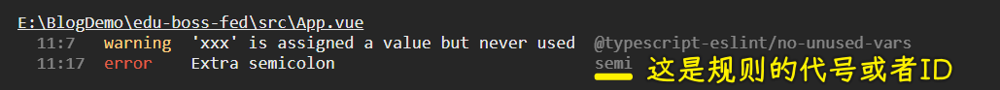
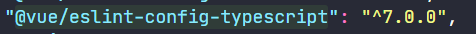

### ✍️ Tangxt ⏳ 2021-07-26 🏷️ vue

# 06-3-代码格式规范

主要说明以下几点：

- 代码格式规范介绍
- 我们项目中配置的具体代码规范是什么
- 遇到代码格式规范错误怎么办
- 如何自定义代码格式校验规范，以此来达到我们想要的需求

## ★介绍

### <mark>1）为什么需要代码格式规范？</mark>

新手写的代码：


> 阅读、维护 -> 差

有经验的同学写的代码：


良好的代码格式规范更有利于：

* 更好的多⼈协作
* 更好的阅读
* 更好的维护
* 降低我们代码出错的几率
* ……

达成良好的共识，是非常有必要的！

### <mark>2）标准是什么？</mark>

代码规范是有好处的，可什么是规范呢？换言之，我们应该用什么样的格式来写代码呢？ -> 标准是啥？

**没有绝对的标准**，下⾯是⼀些⼤⼚商根据多数开发者的编码习惯制定的⼀些编码规范，仅供参考。
  
* [JavaScript Standard Style](https://standardjs.com/) -> 它的名字就叫做「标准风格」，但并不是真正的标准
* [Airbnb JavaScript Style Guide](https://github.com/airbnb/javascript)
* [Google JavaScript Style Guide](https://google.github.io/styleguide/jsguide.html)

> 在前端里边，编码规范不仅仅是 JS 有，HTML、CSS、Vue、React 等都有

💡：JavaScript Standard Style？


💡：Airbnb JavaScript Style Guide

air 前端团队制定的，规则更细致，而「JavaScript Standard Style」只是把最需要的规范规定了一下而已，比较简单！

💡：Google JavaScript Style Guide

谷歌内部制定的编码规范

### <mark>3）选择哪个？</mark>

一看公司，二看个人喜好 -> 没有绝对的好与错

老师建议：

- 个人使用（少的团队，不超过 3 人）：JavaScript Standard Style -> 规则没那么严谨，没有那么多琐碎的细节，只是把通用的规范制定了一下！ 而像「Airbnb JavaScript Style Guide、Google JavaScript Style Guide」这样的，就比较严格，适合大型团队使用

标准只是作为一个规范的参考，那问题来了，我们如何在项目中约束代码规范呢？

### <mark>4）如何让他人都遵守代码规范？</mark>

团队协作开发，只靠⼝头约定肯定是不⾏的，所以要**利⽤⼯具来强制执⾏，让你没办法去犯错**

> 张三遵守约定，而李四则不遵守，结果最终合作写出来的代码是乱七八糟的！

* [JSLint](https://jslint.com/)
* [JSHint](https://jshint.com/)
* [ESLint](https://cn.eslint.org/) -> 目前用的，也是用的最多的，上边两个已经被淘汰了！
* ...

这些都是代码格式校验工具

我们之前用 Vue CLI 创建的项目需要有代码格式验证，具体用的是「`ESLint + Standard config`」：


> 原来编码规范和校验工具是一起的 -> 我其实比较喜欢 Prettier

- `error prevention only` -> ESLint 内置的常见格式校验规则
- `Prettier` -> 既是编码规范，也是一个代码格式校验工具

规范是死的，人是活的，你选择了任何一种规范，如果在不满足你需求的情况下，你可以再进行一些扩展性的修改

## ★项目中的代码规范说明

### <mark>1）项目中的代码规范是什么</mark>

勾选的是「`ESLint + Standard config`」

ESLint 配置⽂件：


`extends`和`rules`是这个文件里边最关键的两个地方

- `extends` -> 使用插件的编码校验规则
- `rules` -> 自定义编码校验规则

从当前这个配置里边，我们需要注意哪些编码规则？

`extends`有三个元素：

- `plugin:vue/essential`：这是简写形式，它的全名是「`eslint-plugin-vue`」 -> Vue.js 开发的插件，专门用来把 ESLint 适配到 Vue 项目中，用来校验 Vue 项目中的`.js、.vue`文件的代码格式规范  
  
  
  
- `@vue/standard`
- `@vue/typescript/recommended`

💡：`plugin:vue/essential`？

文档：[Introduction - eslint-plugin-vue](https://eslint.vuejs.org/)


写 Vue 时，尽量去遵照 Vue 给出的方格指南，或者说是约定！

不需要刻意看完这个 [文档](https://cn.vuejs.org/v2/style-guide/) -> 在写 Vue 时，遇到写法上的问题，再去看文档，然后解决掉即可！ -> 写的多，用的多，自然就知道该怎么写了，不需要刻意看一遍文档（大概粗略看一遍即可）

💡：`@vue/standard`？

> 文档：[standard/eslint-plugin-standard: ESlint Rules for the Standard Linter](https://github.com/standard/eslint-plugin-standard#readme)


这个 [包](https://github.com/vuejs/eslint-config-standard#readme) 把 js standard 校验规则集成到`.js/.vue`里边去了！ -> 所以你在写代码的时候，得按照这个「js standard」的编码规则来，如不写分号，字符串用单引号，函数名和参数之间有空格等 -> 如果不遵守，保存代码，终端就会报错……

> 能不能自动纠错？ -> 之前用编辑器自带的格式化功能，然格式化标准不是「standard」，而是「Prettier」，这就是我想用「Prettier」的原因

💡：`@vue/typescript/recommended`？

> 文档：[vuejs/eslint-config-typescript: eslint-config-typescript for vue-cli](https://github.com/vuejs/eslint-config-typescript#readme)


Vue 官方专门提供了一个插件 -> 用 ESLint 校验 ts 代码

它的校验规则是：[typescript-eslint/packages/eslint-plugin at master · typescript-eslint/typescript-eslint](https://github.com/typescript-eslint/typescript-eslint/tree/master/packages/eslint-plugin) -> 这是我们所关注的


`@vue/typescript/recommended` -> 我们用的是**推荐的**编码规则

打 ✔️ 的都是要求的，你写的 ts 代码不符合打 ✔️ 的要求，那你就去看这个打 ✔️ 的解释，然后修正即可，无须自己过一遍这个 ✔️ 的内容

### <mark>2）总结</mark>


## ★自定义校验规则

编码规范只是一个参考，在实际使用过程中，其实，我们还是得根据自己的需要去做一些灵活的配置，以此来满足自己的需求

### <mark>1）如何⾃定义代码格式校验规范</mark>

想要自定义的话，得借助 ESLint 才行。ESLint 是我们项目中的代码格式校验工具

具体如何做？

我们可以打开 ESLint 的官方文档：[ESLint - Pluggable JavaScript linter - ESLint 中文](https://cn.eslint.org/)

定位到`用户指南 > 配置 > Configuring Rules`：


### <mark>2）例子</mark>

💡：触发`warning` 和 `error`？


可以看到触发了两个规则

如何让代码遵守规则？ -> 去分号 + 使用`xxx`

``` js
const xxx = 'hi'
console.log(xxx)
```

- `warning`级别的：浏览器还能看到页面，当然终端也会显示`warning`
- `error`级别的：浏览器不能看到页面了，同样，终端也会给出错误提示


💡：如何关闭规则？

比如：我写不写分号都是可以的



关闭`semi`规则：


> 每次修改完规则，需要重启`serve`，才会生效！

`semi`规则关闭了，意味着 ESLint 就不会按照`semi`这个规则去校验代码了！

> ASI：JS 自动插入分号 -> 一种不怎么好的机制！

💡：不知道规则 ID 所代表的含义？

查这个规则列表：[List of available rules - ESLint 中文](https://cn.eslint.org/docs/rules/)


💡：有时候修改了规则，重新启动`serve`，但没生效？

这是因为`node_modules`下有个`.cache`，它可以缓存我们的校验规则，比如上一次代码不加分号是可以的，但这一次修改了规则说「必须得加分号」，结果只校验了添加的新代码，对于没加分号的旧代码就直接无视之了

如何解决？ -> 手动清除缓存目录 or `rm -rf node_module/.cache`

💡：如何添加选项？


如：必须添加分号

``` js
{
  'semi': ["error", "always"]
}
```

第一个元素是级别，第二个则是选项

老师不喜欢添加分号！

💡：如果是 TS 代码有问题呢？还是按上边的做法吗？直接一个 ID 名 + `0`就完事儿了吗？

上边的只是针对 JS，如果是 TS，你得找到关于 TS 的 ESLint 配置文档

找到包名：



选中包名字段，拿到它的 [url](https://github.com/vuejs/eslint-config-typescript#readme)，找到它的支持规则：[typescript-eslint/packages/eslint-plugin at master · typescript-eslint/typescript-eslint](https://github.com/typescript-eslint/typescript-eslint/tree/master/packages/eslint-plugin#supported-rules)

需求：写接口时，期望接口成员之间没有分隔符


默认是要求你写分隔符的 -> 如何设置不写分隔符？

格式还是一样的：`'ID':[级别，选项]`


> `requireLast`：接口最后一个成员是否有分隔符？

小结：

`error` -> 找 `ID`，如：


看这个`ID`的详情：[typescript-eslint/member-delimiter-style.md at master · typescript-eslint/typescript-eslint](https://github.com/typescript-eslint/typescript-eslint/blob/master/packages/eslint-plugin/docs/rules/member-delimiter-style.md)

根据 `ID` 详情在`.eslintrc.js`的`rules`里边配置选项！

💡：配置定义在插件中的⼀个规则的时候？

你必须使⽤ `插件名/规则 ID` 的形式。⽐如：

``` js
{
  "plugins": ["plugin1"],
  "rules": {
    "eqeqeq": "off",
    "curly": "error",
    "quotes": ["error", "double"],
    "plugin1/rule1": "error"
  }
}
```

在这些配置⽂件中，规则 `plugin1/rule1` 表示来⾃插件 `plugin1` 的 `rule1` 规则。你也可以使⽤这种格式的注释配置，⽐如：

``` js
/* eslint "plugin1/rule1": "error" */
```

注意：当指定来⾃插件的规则时，确保删除 `eslint-plugin-` 前缀。ESLint 在内部只使⽤没有前缀的名称去定位规则。

> 如`@typescript-eslint/ID` -> `extends`的名字是简写 -> 这似乎是新写法

### <mark>3）总结</mark>

- 对于 ESLint 规则：[List of available rules - ESLint 中文](https://cn.eslint.org/docs/rules/)
- 对于 TS ESLint 规则：[typescript-eslint/packages/eslint-plugin at master · typescript-eslint/typescript-eslint](https://github.com/typescript-eslint/typescript-eslint/tree/master/packages/eslint-plugin#supported-rules)

基本的配置套路：`error` -> `ID` -> 看规则文档列表 -> 看`ID`详细说明 -> 配置规则，解决`error`

> 配置规则时，添加选项，那么数组的第⼀项总是规则的严重程度（数字或字符串）

## ★vscode 配置 ESLint

这所谓⼯欲善其事，必先利其器，个⼈推荐 ESLint + VS Ccode 来写 Vue，绝对有种⻜⼀般的感觉

做法：

安装插件 ESLint

配置：

``` json
{
  "eslint.autoFixOnSave": true, 
  "eslint.validate": [
    "javascript", 
    "javascriptreact",
    "vue-html",
    {
      "language": "vue", 
      "autoFix": true 
    },
    {
      "language": "html",
      "autoFix": true
    }
  ],
  "editor.codeActionsOnSave": {
    "source.fixAll.eslint": true
  }
}
```

每次保存，VS Code 就能标红不符合 ESLint 规则的地⽅，同时还会做⼀些简单的⾃我修正

> 似乎只设置`editor.codeActionOnSave`就行了！

一键修复：`yarn lint` -> 在终端运行，会对所有文件进行简单的格式化

## ★了解更多

➹：[怎么写规范、风格良好的代码？ - 知乎](https://www.zhihu.com/question/26721180)

➹：[带你入门前端工程（二）：统一规范](https://chinese.freecodecamp.org/news/front-end-engineering-uniform-specification/)

➹：[ESlint + Stylelint + VSCode 自动格式化代码 (2020)](https://juejin.cn/post/6892000216020189198/)

➹：[JavaScript ASI 机制详解，不用再纠结分号问题 - 简书](https://www.jianshu.com/p/05cd9981dc56)

➹：[VsCode 保存时自动修复 Eslint 错误 | 前端进阶积累](http://obkoro1.com/web_accumulate/accumulate/tool/Eslint%E8%87%AA%E5%8A%A8%E4%BF%AE%E5%A4%8D%E6%A0%BC%E5%BC%8F%E9%94%99%E8%AF%AF.html#%E4%B8%80%E9%94%AE%E4%BF%AE%E5%A4%8D%E9%A1%B9%E7%9B%AE%E6%A0%BC%E5%BC%8F%E9%97%AE%E9%A2%98%EF%BC%9A)
