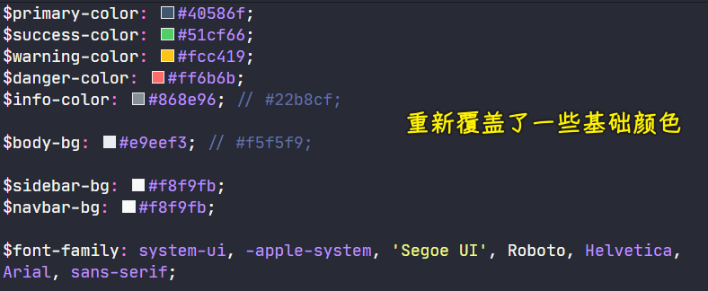

### ✍️ Tangxt ⏳ 2021-07-29 🏷️ Vue

# 06-4-样式处理、接口处理

## ★导入 Element 组件库

Element，⼀套为开发者、设计师和产品经理准备的基于 Vue 2.0 的桌⾯端组件库 -> 非常适合我们快速做中台、后台管理系统这种业务功能开发 -> 它有很多常用组件，非常丰富，我们要做是把该组件库配置到我们的项目中，然后使用它！

- 官⽹：<https://element.eleme.cn/>
- GitHub 仓库：<https://github.com/ElemeFE/element>

#### <mark>1、安装 element</mark>

``` bash
yarn add element-ui
```

#### <mark>2、在 `main.ts` 中导⼊配置</mark>

完整引入：

``` ts
import Vue from 'vue'
import App from './App.vue'
import router from './router'
import store from './store'
import ElementUI from 'element-ui'
import 'element-ui/lib/theme-chalk/index.css'

Vue.config.productionTip = false

Vue.use(ElementUI)

new Vue({
  router,
  store,
  render: h => h(App)
}).$mount('#app')
```

> 按需引入：用什么就引入什么 -> 如果你只用了几个组件，那就按需引入吧，因为这只会打包用到的组件代码 -> 这会优化打包结果
> 
> 完整引入：用了很多个组件 -> 只需要导入一次，所有组件都可以用，甚是方便 -> 缺点：只用几个组件的话，会把所有组件代码都打包到结果当中，造成打包结果体积过大

根据自己需要选择 -> 这个项目用了比较多的组件，所有选择的是「完整引入」

- `import ElementUI from 'element-ui'` -> 加载的是 `element-ui` 的核心组件库
- `import 'element-ui/lib/theme-chalk/index.css'` -> 加载组件的样式
- `Vue.use(ElementUI)` -> 配置组件或注册组件后，才能使用这个组件库

#### <mark>3、测试使用</mark>


随便找一段组件的代码，有效果，意味着这个组件库在我们的项目里边配置成功了！

#### <mark>4、如何使用这个组件库？</mark>

你想要的效果 -> 到文档找组件 -> 找到你想要的组件看它的使用代码，复制粘贴到项目里边 -> 修改组件代码，渲染出你想要的效果

## ★样式处理

### <mark>1）样式处理</mark>

需要对 Element UI 的样式进行一个重新定制，以及个性化的样式（主要是全局相关的）

1. 在`styles`目录下创建 4 个文件
   1. `index.scss` -> 全局样式（在入口模块被加载生成）
   2. `mixin.scss` -> 公共的 `mixin` 混入（可以把重复的样式封装为 `mixin` 混入到复用的地方）
   3. `reset.scss` -> 重置基础样式
   4. `variables.scss` -> 公共样式变量，为了复用，修改时，只需要修改变量即可，这甚是方便
2. 测试 -> 在`main.ts`里边添加`import './styles/index.scss'`以此来导入全局样式，之前的`import 'element-ui/lib/theme-chalk/index.css'`都在`index.scss`里边

💡：`variables.scss`？



> 让系统的主题色通过变量保存起来 -> 前景色、背景色、字体

💡：`index.scss`？

自定义的样式主题


💡：小结？

- 知道如何组织样式代码的
- 样式变量是如何处理的

### <mark>2）共享全局样式变量</mark>

> 文档：[CSS 相关 - Vue CLI](https://cli.vuejs.org/zh/guide/css.html#%E5%90%91%E9%A2%84%E5%A4%84%E7%90%86%E5%99%A8-loader-%E4%BC%A0%E9%80%92%E9%80%89%E9%A1%B9)

能直接在`App.vue`里边使用全局样式变量吗？


这是不能的，你得在这个组件里边`@import`才行！


> CSS 要使用`@`符号，必须使用`~`开头，才能指向`src`目录 -> `@/`是`src/`的别名

如何在不写`@import`的情况下，让每个组件都能直接用这些全局样式变量？

在根目录下创建一个`vue.config.js`，然后添加以下内容即可：

``` js
// vue.config.js
module.exports = {
  css: {
    loaderOptions: {
      // 默认情况下 `sass` 选项会同时对 `sass` 和 `scss` 语法同时生效
      // 因为 `scss` 语法在内部也是由 sass-loader 处理的
      // 但是在配置 `prependData` 选项的时候
      // `scss` 语法会要求语句结尾必须有分号，`sass` 则要求必须没有分号
      // 在这种情况下，我们可以使用 `scss` 选项，对 `scss` 语法进行单独配置
      scss: {
        additionalData: '@import "~@/styles/variables.scss";'
      }
    }
  }
}
```

> 打包`scss`的代码时候，会自动注入`@import "~@/styles/variables.scss";`这个代码


用`prependData`导致这样的错误：


补充：


> `additionalData`是老版本的写法，新版本识别的名字是`prependData`

这其实不是 VS Code 的问题：


> [Sass: Breaking Change: Slash as Division](https://sass-lang.com/documentation/breaking-changes/slash-div)
> 
> [vue-cli vue3 element-ui 自定义样式报错 - 白杨的博客](https://www.fengbaiyang.cn/post/vue-cli-vue3-element-plus-sass-math-error.html)

如何解决这个问题？

把`index.scss`里边的`@import "~element-ui/packages/theme-chalk/src/index";`给注释了，还是在`main.ts`里边引用它比较好！

## ★接口处理

后台为我们提供了数据接口，分别是：

- 前端接口：[edu-front-boot API Documents](http://113.31.105.128/front/doc.html#/home) -> 用前端接口做出来的页面：[拉勾教育 - 拉勾旗下教育平台](http://edufront.lagou.com/#/) -> 提供前台相关的数据接口
- 后台接口：[edu-boss-boot API Documents](http://eduboss.lagou.com/boss/doc.html#/home) -> 做的是后台教育管理系统页面 -> 有关后台内容管理的接口

有些数据，如用户登录，用的是同一套数据接口！ -> 上边两个接口都提供了同一套的登录注册接口！

这两个接口都没有提供 CORS 跨域请求（后端咩有提供） -> 需要我们在客户端配置服务端代理处理跨域请求

如何做呢？

配置客户端层面的服务端代理跨域可以参考官方文档中的说明：

- [配置参考 - Vue CLI](https://cli.vuejs.org/zh/config/#devserver-proxy)
- [chimurai/http-proxy-middleware: The one-liner node.js http-proxy middleware for connect, express and browser-sync](https://github.com/chimurai/http-proxy-middleware)

### <mark>1）配置后端（接口）代理</mark>


> `ws`是 websocket，由于没有用到，所以可以不要这个配置！
> 
> `changeOrigin`建议配置，因为有些服务端配置了反向代理，反向代理会根据`host`进行识别来转发处理，如果这个`host`不正确，如`localhost:8080`，那它根本就不认识，这样一来这转发根本就无法去转发了，因为这识别不了啊！而设置为`true`，就可以把`target`的值作为`host`值，这样才能正常转发！

我们发送`ajax`请求时，是`localhost:8080/boss`，此时会通过我们配置的`proxy`转发到实际的地址`http://eduboss.lagou.com/boss` -> 把`http://eduboss.lagou.com/boss`的响应结果给本地客户端

这样就解决了跨域问题！

### <mark>2）封装请求模块</mark>

> 封装请求模块 -> 方便我们在项目中发请求

安装`axios`：

``` bash
yarn add axios
```

> `axios`是大多数前端项目中发请求的一个选择 -> `axios`封装的非常好，基本上，我们想要的功能`axios`都会有

新建`request.ts`，添加以下内容：

``` ts
import axios from 'axios'

// 创建一个实例对象，可以传递配置选项，目前不需要配，留空即可！
const request = axios.create({
  // 配置选项
  // baseURL,
  // timeout
})

// 请求拦截器

// 响应拦截器

export default request
```

> 配置选项、请求拦截器、响应拦截器，都是封装这个`request`的复杂内容！

测试：

``` ts
// App.vue
import request from '@/utils/request'
request({
  method: 'GET',
  url: '/boss/v2/api-docs?group=edu-boss-boot'
}).then(data => {
  console.log(data)
})
```


可以看到请求是可以正常发出，响应也是可以正常回来的！
