### ✍️ Tangxt ⏳ 2021-08-01 🏷️ Vue

# 06-5-布局


- 设计稿：<http://eduboss.lagou.com/>
- 测试账号
  - 用户名：`18201288771`
  - 密码：`111111`
- 其它设计参考
  - [WOOCMS - 快速开发内容管理系统](https://wooadmin.cn/index/index.html)
  - [我的项目名称 - 后台管理系统](http://demo2.wooadmin.cn/run)
  - [介绍 - cc-ui](https://ladychatterleylover.github.io/cc-ui-web/components/guide/intro/intro.html#%E4%BB%8B%E7%BB%8D)

## ★初始化路由页面组件

> 初始化路由相关的组件

### <mark>1）分析设计稿</mark>

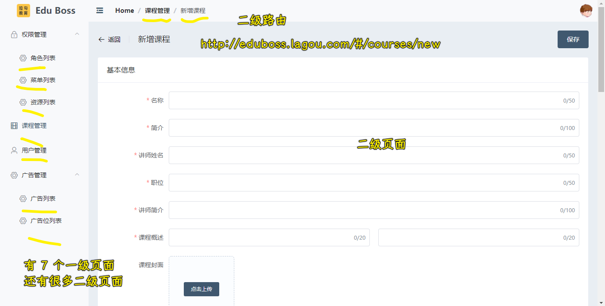

- 课程管理作为首页
- 所有页面的跳转都在侧边栏里边

如何做？

1. 把主要的入口页面（有 `7` 个）创建出来
2. 像「新增」、「编辑」等这样的页面，等项目做到一定时候再去添加

简单来说就是，先把这⼏个主要的⻚⾯配置出来，其它⻚⾯在随后的开发过程中配置

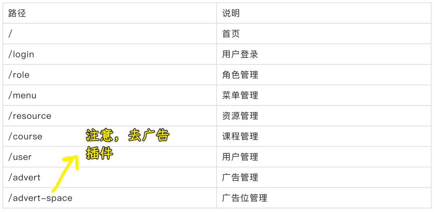

> 可以自己去定义页面的名字，但必须有意义

### <mark>2）创建路由视图组件</mark>

``` bash
`-- views
    |-- advert
    |   `-- index.vue
    |-- advert-space
    |   `-- index.vue
    |-- course
    |   `-- index.vue
    |-- error-page
    |   `-- 404.vue
    |-- home
    |   `-- index.vue
    |-- login
    |   `-- index.vue
    |-- menu
    |   `-- index.vue
    |-- resource
    |   `-- index.vue
    |-- role
    |   `-- index.vue
    `-- user
        `-- index.vue
```

把每一个入口路由，都直接放到`views`下相应的目录里边

为啥要这样做？

- 好处：每一个`index.vue`都有自己的子组件，当我们拆子组件时就可以在当前目录下创建一个`components`目录了，即`components`和`index.vue`同级 -> 这样管理和维护要更方便一些

所以就采取了这样一种做法！

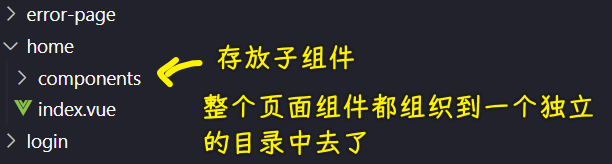

除此之外，像`create.vue`也是和`index.vue`同级的 -> 这样就相当于是`advert/create`了

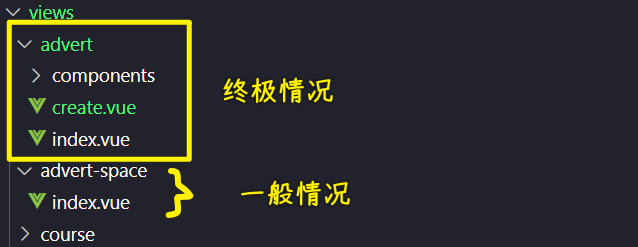

> 都是小写的，多个单词用`-` -> 页面 URL 对大小写不敏感

总之，**这一切都是遵循一定的规格来方便我们调试维护**！

### <mark>3）每个页面的基本架子</mark>

``` html
<template>
  <div class="advert-space">广告位管理</div>
</template>

<script lang="ts">
import Vue from 'vue'
export default Vue.extend({
  name: 'AdvertSpaceIndex'
})
</script>

<style lang="scss" scoped></style>
```

### <mark>4）配置路由</mark>

``` ts
// 路由配置规则
// 遵循 RouteConfig 对每个元素的要求
const routes: Array<RouteConfig> = [
  {
    path: '/login',
    name: 'login',
    component: () => import(/* webpackChunkName: 'login' */ '@/views/login/index.vue')
  },
  {
    path: '/',
    name: 'home',
    component: () => import(/* webpackChunkName: 'home' */ '@/views/home/index.vue')
  },
  {
    path: '/role',
    name: 'role',
    component: () => import(/* webpackChunkName: 'role' */ '@/views/role/index.vue')
  },
  {
    path: '/menu',
    name: 'menu',
    component: () => import(/* webpackChunkName: 'menu' */ '@/views/menu/index.vue')
  },
  {
    path: '/resource',
    name: 'resource',
    component: () => import(/* webpackChunkName: 'resource' */ '@/views/resource/index.vue')
  },
  {
    path: '/course',
    name: 'course',
    component: () => import(/* webpackChunkName: 'course' */ '@/views/course/index.vue')
  },
  {
    path: '/user',
    name: 'user',
    component: () => import(/* webpackChunkName: 'user' */ '@/views/user/index.vue')
  },
  {
    path: '/advert',
    name: 'advert',
    component: () => import(/* webpackChunkName: 'advert' */ '@/views/advert/index.vue')
  },
  {
    path: '/advert-space',
    name: 'advert-space',
    component: () => import(/* webpackChunkName: 'advert-space' */ '@/views/advert-space/index.vue')
  },
  {
    path: '*',
    name: '404',
    component: () => import(/* webpackChunkName: '404' */ '@/views/error-page/404.vue')
  }
]
```

分析：

- 路由懒加载：`() => import(/* webpackChunkName: 'home' */ '@/views/home/index.vue')`
  - 如果不这样做，那么就会把所有路由相关的视图资源打包到一个`chunk`当中去
  - 如果用了懒加载，那么在打包的时候，就会把这个`home`给单独分成一个模块 -> 只有我们去看这个页面的时候，才会去加载这个组件对应的资源，而不是打开主页面，就把所有的资源都给一次性请求加载了！ -> **一种优化可访问性的技巧**
- 路由懒加载默认会生成数字，如`1.js`、`2.js`这样 -> 这不方便我们调试查看和维护 -> 建议给打包出来的块起一个别名
  - 如何起名？ -> 行内注释

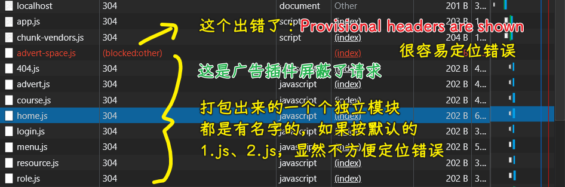

💡：广告插件屏蔽发起的请求？

给`chunk`换个名字就好了，如`'a-dvert-space'`

➹：[chrome 发送请求出现：Provisional headers are shown 提示 - SegmentFault 思否](https://segmentfault.com/a/1190000018191614)

💡：访问不存在的路由？

如：`http://localhost:8080/#/xxx`

- `path`为`*`，表示是任意的

💡：`404`路由配置的顺序会对结果有影响吗？

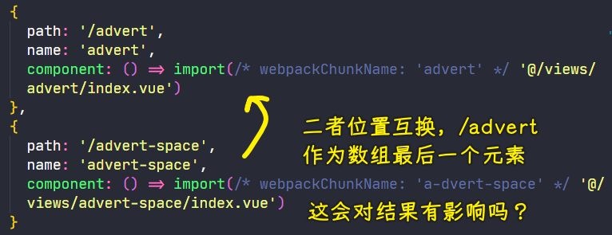

以前必须把`path: '*'`这个路由放置到最后，因为规定路由是从上到下依次匹配的，如果匹配不到，最后就匹配到这个`*`路由，如果你把`*`往前放的话，意味着`*`后边的路由都匹配不到了，毕竟`*`表示任意路由啊，是万能的啊，既然已经适配了，那就不走下边的路由了！

而现在就没有这个问题了，因为现在的`vue-router`内部会把`*`放到数组的最后，即便你把`*`写到第一位，`vue-router`内部都会把它最后边去 -> 总之，**`*`路由的配置放哪儿都行！但建议还是把`*`写到最后边去，因为路由的匹配的规则就是从上往下的处理方式 -> 养成好的书写习惯，方便我们阅读这个路由配置代码**

### <mark>5）做了什么？</mark>

- 创建了简单的路由视图组件
- 配置了路由规则

## ★Layout 和嵌套路由

分析设计稿可知，所有的页面（不包括登录页面和 404 页面）都有共同的侧边栏和顶部，变化的只有中间这个视图！

> 文档：[嵌套路由 - Vue Router](https://router.vuejs.org/zh/guide/essentials/nested-routes.html)

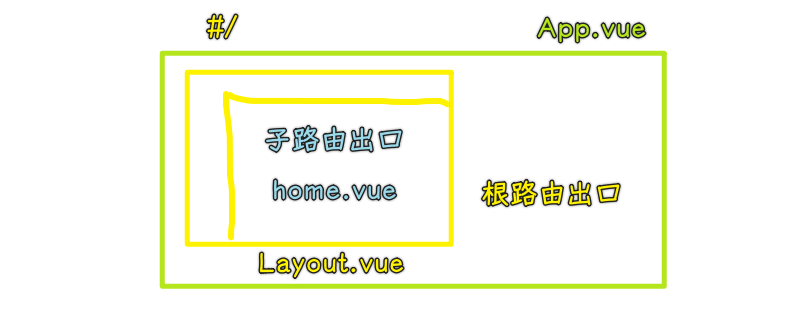

做法：

1. 给`home`等这样的页面添加公共的父路由
2. 用嵌套路由的方式给`home`这样的页面做侧边栏和顶部 -> 就像是给一个东西加一个壳子
3. 嵌套路由配置
4. 让子路由渲染到父路由的内部
   1. `/`在`App.vue`里边的`router-view`渲染了`Layout`组件
   2. `/home`视图的渲染位置是`Layout`的`template`里边的`router-view`

嵌套路由配置：

``` ts
const routes: Array<RouteConfig> = [
  {
    path: '/login',
    name: 'login',
    component: () => import(/* webpackChunkName: 'login' */ '@/views/login/index.vue')
  },
  {
    path: '/',
    component: Layout,
    children: [
      {
        path: '', // 默认子路由
        name: 'home',
        component: () => import(/* webpackChunkName: 'home' */ '@/views/home/index.vue')
      },
      {
        path: '/role',
        name: 'role',
        component: () => import(/* webpackChunkName: 'role' */ '@/views/role/index.vue')
      },
      {
        path: '/menu',
        name: 'menu',
        component: () => import(/* webpackChunkName: 'menu' */ '@/views/menu/index.vue')
      },
      {
        path: '/resource',
        name: 'resource',
        component: () => import(/* webpackChunkName: 'resource' */ '@/views/resource/index.vue')
      },
      {
        path: '/course',
        name: 'course',
        component: () => import(/* webpackChunkName: 'course' */ '@/views/course/index.vue')
      },
      {
        path: '/user',
        name: 'user',
        component: () => import(/* webpackChunkName: 'user' */ '@/views/user/index.vue')
      },
      {
        path: '/advert',
        name: 'advert',
        component: () => import(/* webpackChunkName: 'advert' */ '@/views/advert/index.vue')
      },
      {
        path: '/advert-space',
        name: 'advert-space',
        component: () => import(/* webpackChunkName: 'a-dvert-space' */ '@/views/advert-space/index.vue')
      }
    ]
  },
  {
    path: '*',
    name: '404',
    component: () => import(/* webpackChunkName: '404' */ '@/views/error-page/404.vue')
  }
]
```

💡：`home`是`/`，父路由也是`/`？

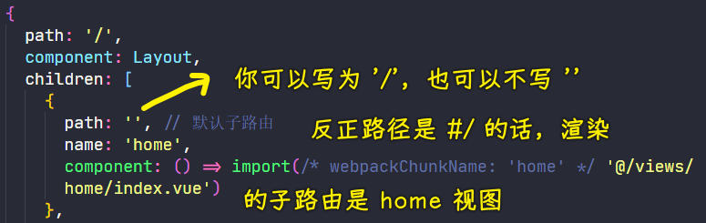

给`home`路径留空，即`path: ''`，意味着这是默认的子路由 -> 这是`vue-router`本身的规则 -> 推荐这种留空这种做法！

## ★Container 布局容器

### <mark>1）快速实现页面布局</mark>

> 文档：[组件 - Element](https://element.eleme.cn/#/zh-CN/component/container)

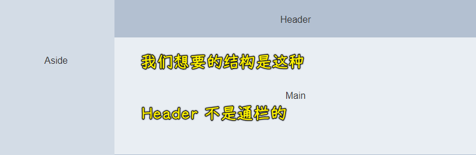

定义结构：

``` html
<el-container>
  <el-aside width="200px">Aside</el-aside>
  <el-container>
    <el-header>Header</el-header>
    <el-main>Main</el-main>
  </el-container>
</el-container>
```

结构有了，就加样式

如何加？ -> 打开开发者工具审查元素，看看元素的`class`值，然后添加样式即可，一般组件标签就是`class`名

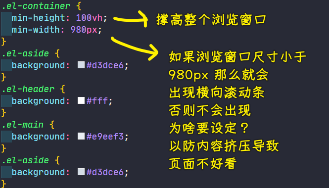

## ★侧边栏菜单

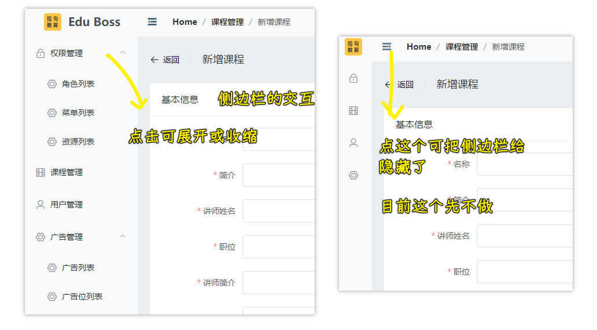

侧边栏里边的数据不是写死的，比如，张三就只有「课程管理」和「用户管理」这两个菜单，而李四则只有「广告管理」

总之，不同的用户有不同的管理权限，看到的侧边栏也会有所不一样！ -> 这是**动态加载进来的**！

做到登录、权限时，再搞动态数据，目前就通过写死的方式，把结构给搭建出来！

### <mark>1）侧边栏</mark>

搜索「menu」：[NavMenu 导航菜单 - Element](https://element.eleme.cn/#/zh-CN/component/menu)

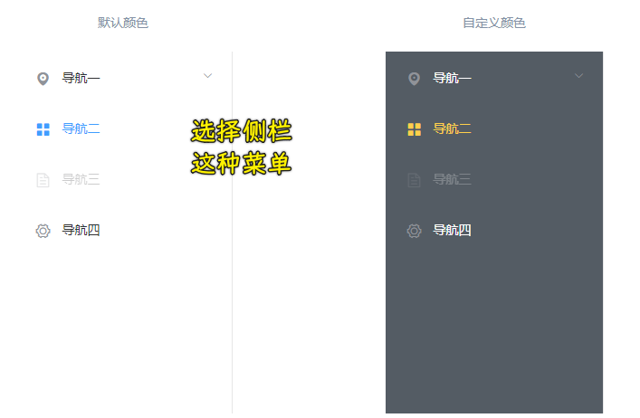

💡：侧边栏代码放到哪儿去？

放到`layout`旗下的`index.vue`吗？如果真这样放，那之后的`header`和`main`位置，岂不是也得放很多代码？

这样一来`index.vue`未免也太大了吧！

所以我们在同级下创建了一个`components`目录：

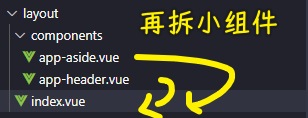

💡：在`layout/index.vue`里边使用 `AppAside` 组件？

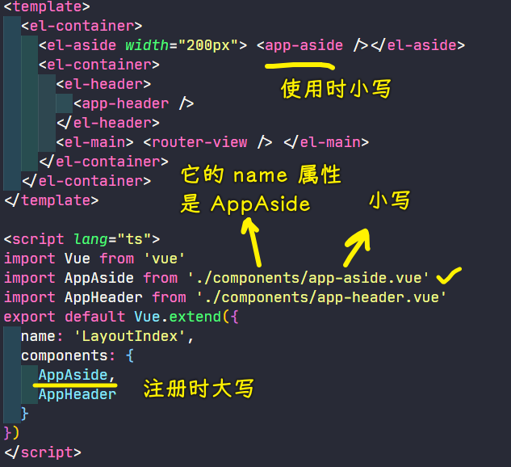

💡：如何确定`handleOpen`的参数类型？

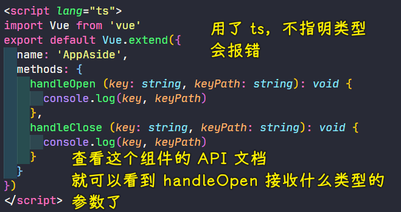

参数类型确定：

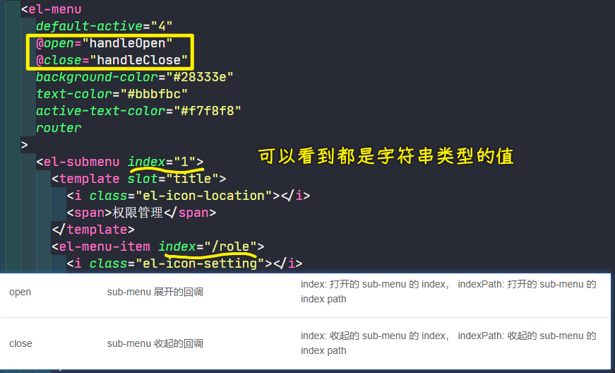

> `index`是唯一的 -> 不要重复

💡：菜单、子菜单、菜单项？

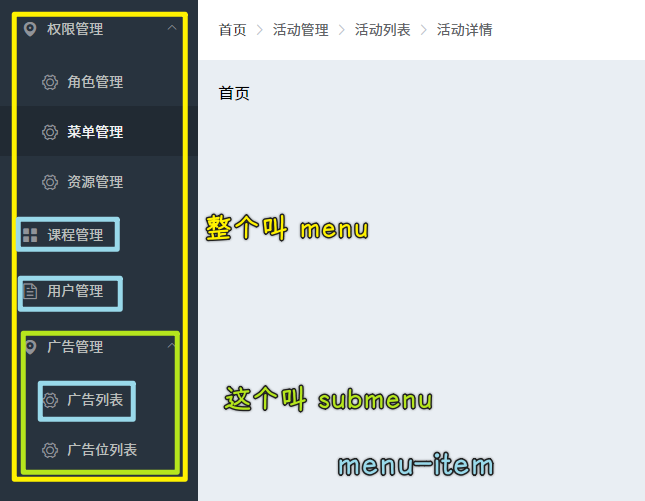

在改 copy 自 element-ui 代码时，告诉自己哪些子菜单是没有菜单项的，如果没有菜单项，那么就让这个菜单项与菜单同级！

💡：让菜单有路由的功能？

点某个菜单项，就会让`Main`区域显示对应路由的视图

在`el-menu`添加一个`router`属性就好了 -> 它会以菜单项的`index`的值作为路由跳转的`path`！

💡：子路由的出口？

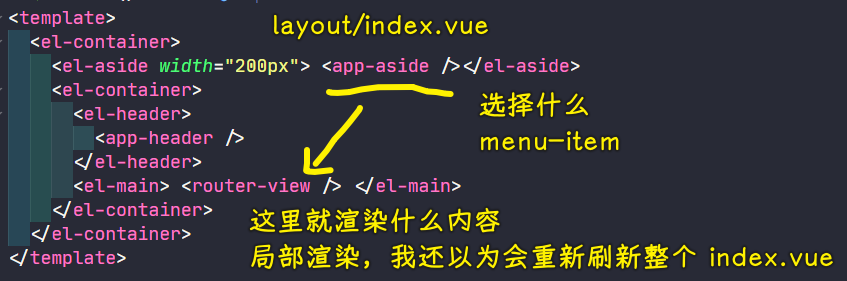

💡：选中某个子菜单会有样式突出？

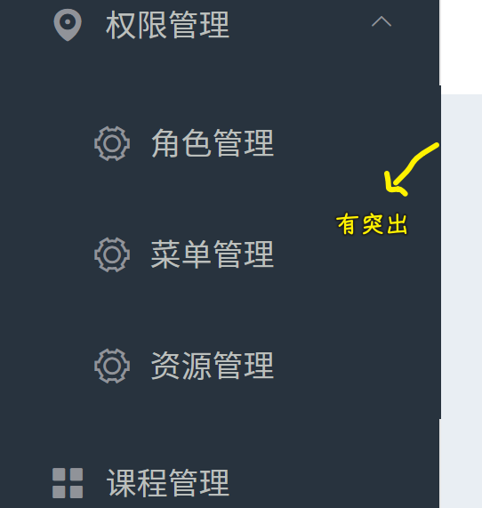

解决：

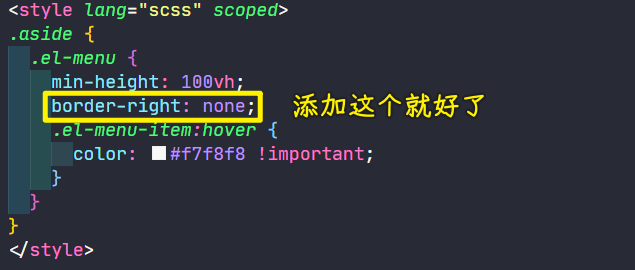

➹：[Element NavMenu 侧边栏导航栏突出问题](https://blog.csdn.net/weixin_45669668/article/details/108865092)

---

目前这个菜单栏的数据是写死的，之后会根据不同用户的权限来动态生成数据，这无非就是需要完善一些样式罢了！ -> 看文档，学会使用`el-menu`！

## ★头部 Header

> 折叠整个菜单的功能，会在讲动态菜单栏的时候讲！

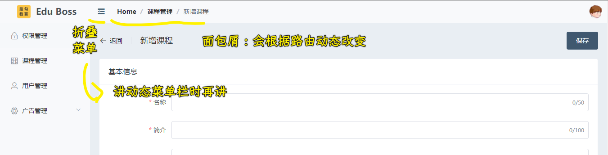

文档：

- [Breadcrumb 面包屑](https://element.eleme.cn/#/zh-CN/component/breadcrumb#breadcrumb-mian-bao-xie)
- [Avatar 头像](https://element.eleme.cn/#/zh-CN/component/avatar)
- [Dropdown 下拉菜单](https://element.eleme.cn/#/zh-CN/component/dropdown#dropdown-xia-la-cai-dan)

### <mark>1）app-header</mark>

同 `app-aside` 一样，也是搞一个独立的组件出来，然后在导入到`layout/index.vue`里边去使用！

💡：面包屑？

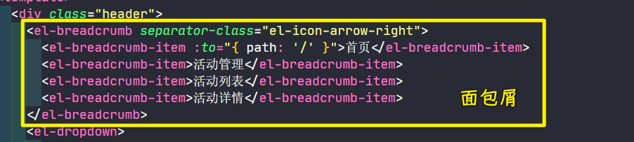

💡：当前用户登录信息？

其实就是一个下拉菜单的事儿！

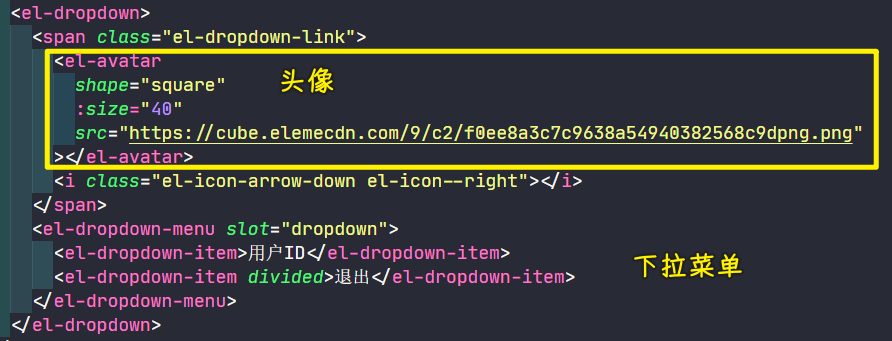

用户登录成功后，会显示它的`ID`和头像！

## ★总结

使用 Element UI 的姿势：根据文档，CRM，把组件处理成自己想要的效果！
