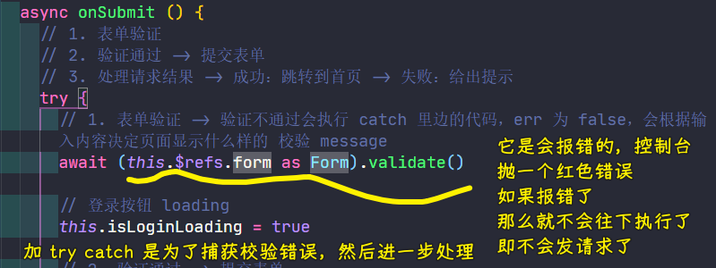

### ✍️ Tangxt ⏳ 2021-08-03 🏷️ Vue

# 06-6-登录

`layout`基本处理好以后，接下来就先来搞登录页面，为啥先搞登录？

因为有了登录，就有了用户的身份 token，唯有这样，我们才能进行用户管理、菜单管理等这些操作！

## ★页面布局


文档：[Form 表单](https://element.eleme.cn/#/zh-CN/component/form#form-biao-dan)

💡：`login/index.vue`

拷贝代码：


别忘了把 JS 里边的数据也给复制过去，不然会报错！

选择顶部对齐：


给样式：


## ★接口测试

> 实现登录的业务功能

### <mark>1）业务流程</mark>

1. 输入手机号和密码 -> 测试账号`18201288771+111111`
2. 表单验证
3. 点击登录
   1. 登录成功 -> 跳转到首页
   2. 登录不成功 -> 提示为啥不成功

实现思路：

先完成主体的功能，如保证输入正确的数据，然后登录成功，之后再去完善一些细节，如表单验证等

### <mark>2）数据接口</mark>

💡：登录接口在哪？

文档：[edu-front-boot API Documents](http://113.31.105.128/front/doc.html#/home)


💡：一个接口大概有哪些内容？

请求：


响应状态：


> 不同的响应码有不同的含义

响应参数 & 响应成功的示例：


---

有了接口以后，建议不要直接去写代码，而是先测试一下这个接口是否是 ok 的，也就是说知道这个接口怎么用以后再去编码，换言之，你得写一个完整的请求 url，再去写代码去发送请求

接口不知道怎么用，意味着你的功能怎么写都是错的……

### <mark>3）如何测试接口？</mark>

💡：接口文档侧边有一个在线「调试功能」

发送请求：


本质是这个：

``` bash
curl -X POST -H  "Accept:*/*" -H  "Authorization:access_token" -H  "Request-Origion:Knife4j" -H  "Content-Type:application/x-www-form-urlencoded" --data-urlencode  "password=111111&phone=18201288771" "http://113.31.105.128/front/user/login"
```

响应内容：


如果输入错误的密码：


`206`是啥意思？ -> 看接口文档，不同的状态码有不同的含义，相应地你可能会写出不一样的代码！

---

文档给的接口测试并不通用，毕竟有的公司根本就没有这样的文档或者说用的不是这种形式的文档，也就是说有文档，但没有直接这样在线调试的功能，说白了，约束性比较强

推荐另一个测试工具：Postman

💡：Postman

下载：[Download Postman - Try Postman for Free](https://www.postman.com/downloads/)

Postman 不依赖任何文档型的，就是一个统一的专门用来测接口的软件

基本使用：


输入错误的：


可以看到这个接口是没有问题的！

---

这样测试的问题，我们知道会有很多接口需要测试，难道每个测试接口都得在前边加一个地址吗？这样不麻烦吗？


保存已测试过的接口：


把基础路径单独管理起来，这样不用每次测试都输入基础路径：


一旦基础路径变了，你就去修改`URL`的值就好了

对了，这个工具还支持不同的环境，如生产环境下的`URL`是什么，开发环境下的`URL`又是什么……


➹：[Postman 设置环境变量](https://blog.csdn.net/ruanhao1203/article/details/79096279)

---

之后测试的接口，都通过这种方式去管理和维护起来！

总之，你得要养成这种开发习惯——用接口之前，先测试接口是否有问题，如果没有问题，再去开发功能，一定要确保每一个环节它都是正确的，才进行下一个环节……

## ★请求登录

> 接口测试好后，下一步就是编码环节

### <mark>1）实现思路</mark>

1. 拿到提交表单的数据 -> 测试输入的数据是否被`data`绑定成功了，这一点可以通过 Vue 的调试工具来直接观察它！
2. 点击「登录」按钮，提交数据
   1. 表单验证
   2. 验证听过 -> 提交表单
   3. 处理请求结果
      1. 成功：跳转到首页
      2. 失败：给出提示

目前，我们要做的这一步是「提交表单」，发送请求

### <mark>2）提交表单，发送请求</mark>


`axios`默认发送的是`application/json`：


而后端是不认识这种数据的，于是正常响应回了这个：

``` json
{"state":201,"message":"非法的手机号","content":null,"success":false}
```

你指定了请求头为`'content-type': 'application/x-www-form-urlencoded'`？

发送的还是 `json` 格式的数据

于是我们用了`qs`：


💡：转换`axios`的默认发送数据的格式？

文档：[axios/axios: Promise based HTTP client for the browser and node.js](https://github.com/axios/axios#using-applicationx-www-form-urlencoded-format)

对于浏览器，有两种姿势可以做到：

1. `URLSearchParams`：HTML5 新增的一个 API -> 有兼容性问题，不是所有浏览器都支持 -> 如果你想用这个，那你最好加个`polyfill`做兼容处理
2. `qs`库：使用第三方模块`QueryString` -> 推荐使用这个，因为更稳定一些


### <mark>3）总结</mark>

- 根据接口要求初始化表单数据 -> 测试输入数据是否和`data`绑定了
- 请求提交数据 -> 处理`json`格式的数据，使用`qs`模块

## ★处理请求结果

处理请求结果的流程：

- 成功 -> 跳到首页
- 失败 -> 给出提示

💡：如何知道这个请求结果是成功还是失败？

在接口文档里边可以看到，有自己自定义的一套状态码，而不是那个所谓的 HTTP 响应状态码


响应结果是成功的数据结构：

``` js
{
  "state": 1,
  "message": "success",
  "content": "……",
  "success": true
}
```

最终代码：


> 后端也有对输入内容进行验证（如手机号非法等），毕竟有些请求不是从浏览器发出去的，我们可以通过终端发过去

💡：不用`window.alert()`给提示登录成功与否？

因为这不好看，因此我们使用了`Message`组件来搞消息提示

---

至此，登录的基本逻辑就完成了！

## ★请求期间禁用按钮点击

问题：模拟在网络慢的情况下，用户点击按钮，没有反应，以致连续不断地点按钮？


这样做会导致用户端发多次请求的问题


如何解决这个问题？

- 点击提交按钮，就会出现一个转圈圈的按钮，即表示请求是`loading`状态的，用户此刻是无法再次点击的


怎么做？

- 为`el-button`添加`loading`属性就好了

代码：


## ★表单验证

> 在防止用户犯错的前提下，尽可能让用户更早地发现并纠正错误。

目前是后端验证输入结果的：


这样发请求验证，会造成资源浪费，我们完全可以在客户端验证用户输入的数据是否符合规则……

💡：如何在客户端校验表单？

文档：[Form 表单 - 表单验证](https://element.eleme.cn/#/zh-CN/component/form#biao-dan-yan-zheng)


💡：验证规则，我们想要用正则表达式来写？

文档：[Form 表单 - 自定义校验规则](https://element.eleme.cn/#/zh-CN/component/form#zi-ding-yi-xiao-yan-gui-ze)

自定义验证，其实用的是 [yiminghe/async-validator: validate form asynchronous](https://github.com/yiminghe/async-validator) 这个库

该文档里边就有详细地校验规则，比如：


代码：


效果：


💡：客户端验证失败后，点击「登录」按钮，就不要发请求了

通过 JS 拿到验证的结果，才去决定是否去提交表单，目前仅仅是一个表单校验的页面交互罢了……

思路：调用表单组件的`validate`方法

做法：

1. 通过`this.$refs.form`拿到表单组件，但是 TS 需要校验它的类型
   1. 默认推导的类型是`Vue`，而这显然是没有`validate`方法的，所以 TS 校验不通过
   2. 用`any` -> `(this.$refs.form as any).validate()` -> 不建议这么做，实在不行再用`any`，总之，有类型还是用类型的哈！因为这样 TS 才是有意义的，不然，你用 TS 有啥意义呢，都成了`AnyScript`了
   3. 如何知道`el-form`是啥类型？-> 找它的源代码
      1. 导入`Form`组件：`import { Form } from 'element-ui'`
      2. `Form Component`是这样定义的：`export class Form extends ElForm {}`
      3. 所以`el-form`的类型是`Form`
2. 确定表单组件的类型：`await (this.$refs.form as Form).validate()`
   1. 不传回调函数给`validate`，那么返回值是一个`Promise`对象，所以我们加了`await`等待它的最终结果值

💡：为啥加`try...catch`？



不加的情况：


加的情况：


💡：找类型？


## ★封装请求方法

目前，关于登录的业务逻辑基本上做得差不多了，接下来做一些简单的小优化

优化的第一点是——请求


把`request()`封装成一个方法，然后在`login/index.vue`里边直接调用

这样做的目的是方便我们对接口进行统一管理和维护

💡：怎么优化请求？

具体做法很简单，在`services`里边，根据接口的类别把它们分门别类的封装起来

如我们这个登录请求是跟用户相关的，所以我们创建一个了`services/user.ts`

那么这个`user.ts`就是跟用户相关的请求模块

该模块就是导出一个一个的函数，每一个函数都封装了一个接口


使用：


---

之后，所有的请求都采用类似的方式，只要有请求都通过上边这种方式来封装成一个方法，然后再去调用

这样做的好处：

- 让代码便于查看，维护起来也更方便了！ -> 毕竟，一旦接口有问题，我们就直接找`services`了，只要接口有问题，就能快速定位问题所在了！

## ★关于请求体 data 和 ContentType 的问题

axios 处理不同类型的`data` 时 -> 请求头`Content-Type`也会跟着变化


- 如果 `data` 是普通对象，则 `Content-Type` 是 `application/json`
- 如果 `data` 是 `qs.stringify(data)` 转换之后的数据：`key=value&key=value`，则 `Content-Type` 会被设置为 `application/x-www-form-urlencoded`
- 有时候我们想要用`axios`上传文件 -> 如果 `data` 是 `FormData` 对象，则 `Content-Type` 是 `multipart/form-data`

总之，我们不用手动地去写`Content-Type`，`axios`会自动根据`data`的数据格式去生成请求头`Content-Type`

## ★了解更多

➹：[编程式的导航 - Vue Router](https://router.vuejs.org/zh/guide/essentials/navigation.html)

➹：[问题：在 vue 中 this.$router.push 怎么使用，query 和 params 有何区别？ - 华为云](https://www.huaweicloud.com/articles/d7a66d653e8bf1de0539b33f4d84d457.html)

➹：[四种常见的 POST 提交数据方式 - JerryQu 的小站](https://imququ.com/post/four-ways-to-post-data-in-http.html)

➹：[Content-Type - HTTP - MDN](https://developer.mozilla.org/zh-CN/docs/Web/HTTP/Headers/Content-Type)