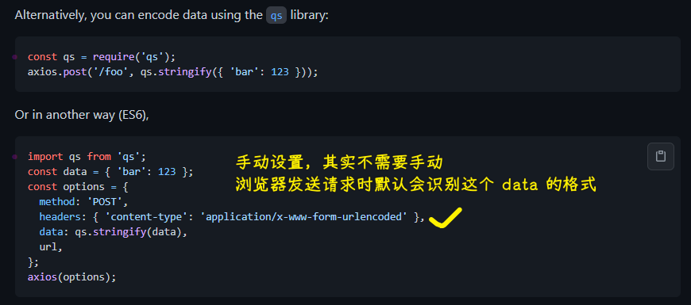

### ✍️ Tangxt ⏳ 2021-08-03 🏷️ Vue

# 06-6-登录

`layout`基本处理好以后，接下来就先来搞登录页面，为啥先搞登录？

因为有了登录，就有了用户的身份 token，唯有这样，我们才能进行用户管理、菜单管理等这些操作！

## ★页面布局


文档：[Form 表单](https://element.eleme.cn/#/zh-CN/component/form#form-biao-dan)

💡：`login/index.vue`

拷贝代码：


别忘了把 JS 里边的数据也给复制过去，不然会报错！

选择顶部对齐：


给样式：


## ★接口测试

> 实现登录的业务功能

1）业务流程

1. 输入手机号和密码 -> 测试账号`18201288771+111111`
2. 表单验证
3. 点击登录
   1. 登录成功 -> 跳转到首页
   2. 登录不成功 -> 提示为啥不成功

实现思路：

先完成主体的功能，如保证输入正确的数据，然后登录成功，之后再去完善一些细节，如表单验证等

2）数据接口

💡：登录接口在哪？

文档：[edu-front-boot API Documents](http://113.31.105.128/front/doc.html#/home)


💡：一个接口大概有哪些内容？

请求：


响应状态：


> 不同的响应码有不同的含义

响应参数 & 响应成功的示例：


---

有了接口以后，建议不要直接去写代码，而是先测试一下这个接口是否是 ok 的，也就是说知道这个接口怎么用以后再去编码，换言之，你得写一个完整的请求 url，再去写代码去发送请求

接口不知道怎么用，意味着你的功能怎么写都是错的……

3）如何测试接口？

💡：接口文档侧边有一个在线「调试功能」

发送请求：


本质是这个：

``` bash
curl -X POST -H  "Accept:*/*" -H  "Authorization:access_token" -H  "Request-Origion:Knife4j" -H  "Content-Type:application/x-www-form-urlencoded" --data-urlencode  "password=111111&phone=18201288771" "http://113.31.105.128/front/user/login"
```

响应内容：


如果输入错误的密码：


`206`是啥意思？ -> 看接口文档，不同的状态码有不同的含义，相应地你可能会写出不一样的代码！

---

文档给的接口测试并不通用，毕竟有的公司根本就没有这样的文档或者说用的不是这种形式的文档，也就是说有文档，但没有直接这样在线调试的功能，说白了，约束性比较强

推荐另一个测试工具：Postman

💡：Postman

下载：[Download Postman - Try Postman for Free](https://www.postman.com/downloads/)

Postman 不依赖任何文档型的，就是一个统一的专门用来测接口的软件

基本使用：


输入错误的：


可以看到这个接口是没有问题的！

---

这样测试的问题，我们知道会有很多接口需要测试，难道每个测试接口都得在前边加一个地址吗？这样不麻烦吗？


保存已测试过的接口：


把基础路径单独管理起来，这样不用每次测试都输入基础路径：


一旦基础路径变了，你就去修改`URL`的值就好了

对了，这个工具还支持不同的环境，如生产环境下的`URL`是什么，开发环境下的`URL`又是什么……


➹：[Postman 设置环境变量](https://blog.csdn.net/ruanhao1203/article/details/79096279)

---

之后测试的接口，都通过这种方式去管理和维护起来！

总之，你得要养成这种开发习惯——用接口之前，先测试接口是否有问题，如果没有问题，再去开发功能，一定要确保每一个环节它都是正确的，才进行下一个环节……

## ★请求登录

> 接口测试好后，下一步就是编码环节

1）实现思路

1. 拿到提交表单的数据 -> 测试输入的数据是否被`data`绑定成功了，这一点可以通过 Vue 的调试工具来直接观察它！
2. 点击「登录」按钮，提交数据
   1. 表单验证
   2. 验证听过 -> 提交表单
   3. 处理请求结果
      1. 成功：跳转到首页
      2. 失败：给出提示

目前，我们要做的这一步是「提交表单」，发送请求

2）提交表单，发送请求


`axios`默认发送的是`application/json`：


而后端是不认识这种数据的，于是正常响应回了这个：

``` json
{"state":201,"message":"非法的手机号","content":null,"success":false}
```

你指定了请求头为`'content-type': 'application/x-www-form-urlencoded'`？

发送的还是 `json` 格式的数据

于是我们用了`qs`：


💡：转换`axios`的默认发送数据的格式？

文档：[axios/axios: Promise based HTTP client for the browser and node.js](https://github.com/axios/axios#using-applicationx-www-form-urlencoded-format)

对于浏览器，有两种姿势可以做到：

1. `URLSearchParams`：HTML5 新增的一个 API -> 有兼容性问题，不是所有浏览器都支持 -> 如果你想用这个，那你最好加个`polyfill`做兼容处理
2. `qs`库：使用第三方模块`QueryString` -> 推荐使用这个，因为更稳定一些



3）总结

- 根据接口要求初始化表单数据 -> 测试输入数据是否和`data`绑定了
- 请求提交数据 -> 处理`json`格式的数据，使用`qs`模块

## ★处理请求结果

