### ✍️ Tangxt ⏳ 2021-08-13 🏷️ Vue

# 06-7-身份认证

## ★把登录状态存储到 Vuex 容器中

目前的登录功能毫无意义，我们要做登录是为了进入后台页面，而现在即便不用登录也能直接输入地址进入后台页面 -> 这显然是有问题的

我们要做的：用户没有登录是不能访问后台页面的


思路：

1. 登录成功，记录登录状态 -> 状态需要能够被全局访问（放到 Vuex 容器中）
  - 注意：这不是像全局变量一样全局访问，而是让这个状态可以在应用的任何模块、任何组件中能够访问到这个登录状态，简单来说，无论是在组件的`index.vue`还是`.ts`文件我都能拿到这个登录状态
2. 在访问需要登录的页面的时候 -> 判断有没有登录状态 -> 利用路由的拦截器来做
  - 有 -> 让你进来这个页面
  - 没有 -> 不让你进来

怎么做？ -> 先把第一步处理好，再来做第二步

### <mark>1）登录成功，记录登录状态</mark>

1. 定位到`store/index.ts`，在`state`里边存储全局共享数据`user`（它存有用户 ID、用户昵称、用户 token 等表示用户身份的相关数据） -> 默认是`null`
2. 什么时候让`user`有值？ -> 让`user`值，是`mutation`干的活儿 -> `payload`载荷数据，即用户传递的数据，简单来说，就是用户传什么`playload`，那么你就给`user`赋值什么数据
   1. 注意：传递的`content`是字符串，需要`JSON.parse`一下
3. 什么时候调用`mutation`？ -> 当用户登录成功以后，就调用`setUser`方法
4. 页面刷新或关闭再打开页面，容器状态不见了？
   1. 容器的状态实现了数据共享，在组件里面访问方便，但是没有持久化的功能
5. 让登录状态这种数据持久化 -> 放到本地存储当中来进行持久化，让数据不丢失
   1. 注意：本地存储只能存字符串

使用：


Vuex 数据容器：


💡：`localStorage`？


💡：`JSON.parser('null')`？

得到是`null`，它的数据类型是`Null`

## ★校验页面访问权限

> 路由拦截器结合`meta`来做访问限定

要做的功能：

- 校验页面是否需要登录才能访问
  - 如果需要登录，那就校验通过后才能访问
    - 如果校验不通过，那就返回登录页面

使用路由拦截器实现这个功能

文档：[导航守卫 - 全局前置守卫 - Vue Router](https://router.vuejs.org/zh/guide/advanced/navigation-guards.html#%E5%85%A8%E5%B1%80%E5%89%8D%E7%BD%AE%E5%AE%88%E5%8D%AB)

在整个导航流程里边会触发很多钩子，我们要做的路由拦截器，就需要用到`router.beforeEach()`这个钩子

### <mark>1）`router.beforeEach()`</mark>

测试代码：

``` js
// router/index.ts

// 全局前置守卫：任何页面的访问都要经过这里
// to：要去哪里的路由信息
// from：从哪里来的路由信息
// next：通行的标志
router.beforeEach((to, from, next) => {
  console.log('进入了路由全局守卫')
  console.log('to => ', to)
  console.log('from => ', from)
})
```

测试效果：


我们是直接从地址栏输入地址访问`user`页面的，所以它的`from`路由信息是`null`或着说是从根路径`/`进入`user`页面的（默认是这个）

为了更好地测试`from`效果，我们添加了`next`：

``` js
router.beforeEach((to, from, next) => {
  console.log('进入了路由全局守卫')
  console.log('to => ', to)
  console.log('from => ', from)
  // 路由守卫中一定要调用 next，否则页面无法展示
  next()
})
```


当你点击跳转，也就是访问其它路由页面，那么你能否正常跳过去呢？也就是能否`next`过去？

因此，我们需要判断能否跳过去？

💡：第一种做法

``` js
if (to.path !== '/login') {
  // 校验登录状态
}
```

这种做法很不灵活，因为它把所有不是`login`的页面都给校验一番了…… -> 这样做卡的死死的，不灵活

💡：第二种做法

使用`meta`元信息，为路由自定义一些数据，以此来做逻辑处理 -> 相当于是一个**校验标志**

哪个路由需要登录才能访问，那么你就为哪个路由添加`meta`（**这是一种更灵活的配置**）：

``` js
{
  path: '/user',
  name: 'user',
  component: () => import(/* webpackChunkName: 'user' */ '@/views/user/index.vue')
  meta: {
    requiresAuth: true // 自定义数据
  } // meta 默认就是一个空对象
}
```

`meta`的值在`to`里边就可以获取到，这样一来，我们就能很灵活的配置哪些路由需要登录才能访问了！ -> 有`requiresAuth: true`意味着该路由需要登录才能访问，没有（`404`页面），则不需要登录，可以直接访问

更强制的添加`meta`：不需要每一个子路由都添加`requiresAuth: true`，我们只要对父路由添加就好了


---

💡：在路由跳转前的逻辑处理代码？


## ★测试获取当前登录用户信息接口


先完成「展示当前用户登录信息」这个功能

这个功能的实现思路：

1. 找到数据接口
2. 发送请求拿到数据
3. 绑定数据展示到页面中去

💡：用户接口——用户基本信息？

文档：[edu-front-boot API Documents](http://113.31.105.128/front/doc.html#/edu-front-boot/%E7%94%A8%E6%88%B7%E6%8E%A5%E5%8F%A3/getInfoUsingGET)

测试接口：

> 需要身份标识`token`（请求类型是`header`，意味着要把`token`写在请求头`Authorization`），类似你要有会员卡才能到这个店消费


之后很多的接口都需要提供用户的身份，也就是`token`，不然，这接口就拿不到我们所期望的数据了

所有测试接口都自动设置`Authorization`：

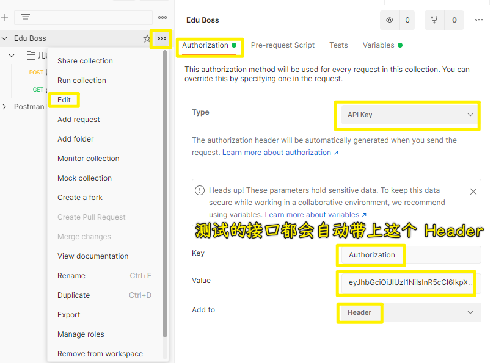

> `Ctrl + s`保存

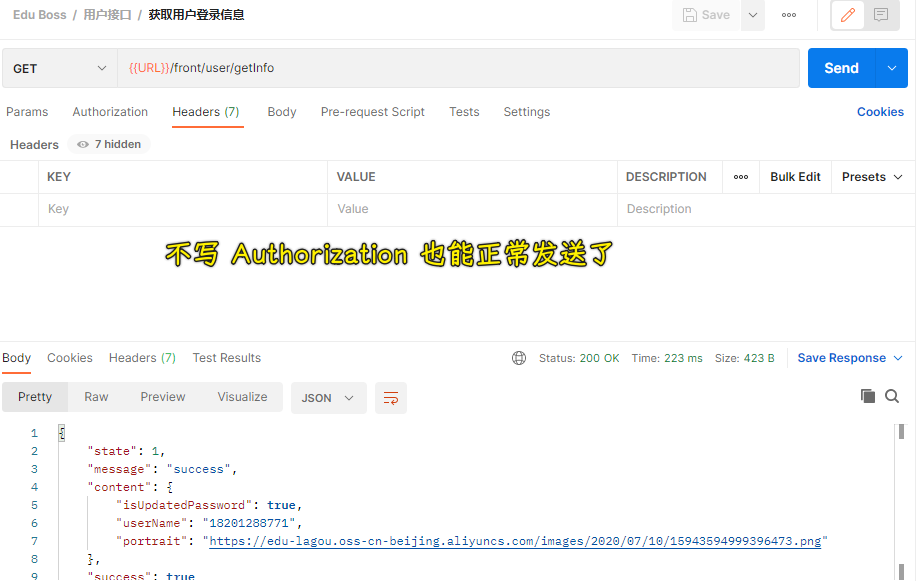

## ★登录成功跳转回原来页面

现状：

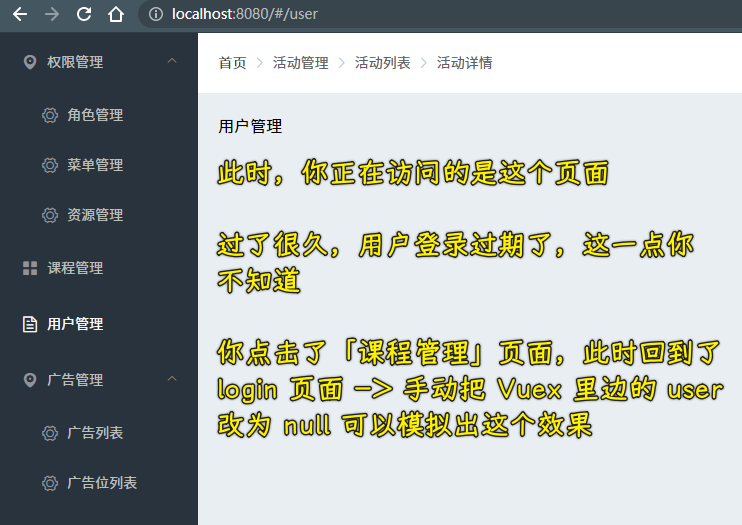

期望的效果：

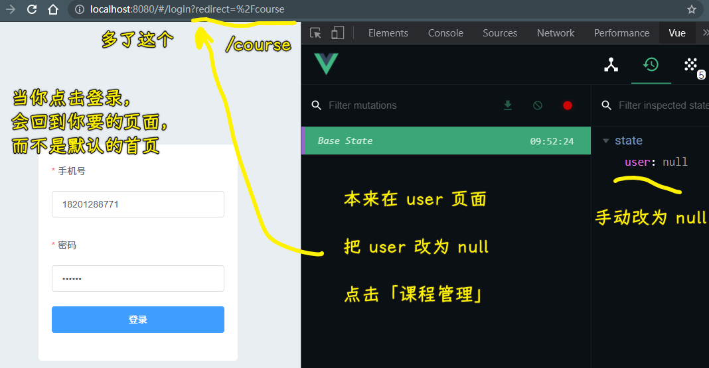

💡：代码

> `this.$router.push`方法接收一个字符串或者是`RawLocation`地址对象

拦截器（给`query`）：

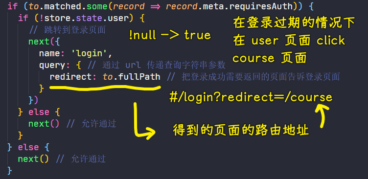

登录页（看有没有`query`）：

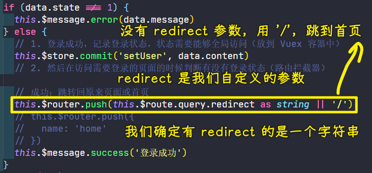

💡：如何获取路由数据？

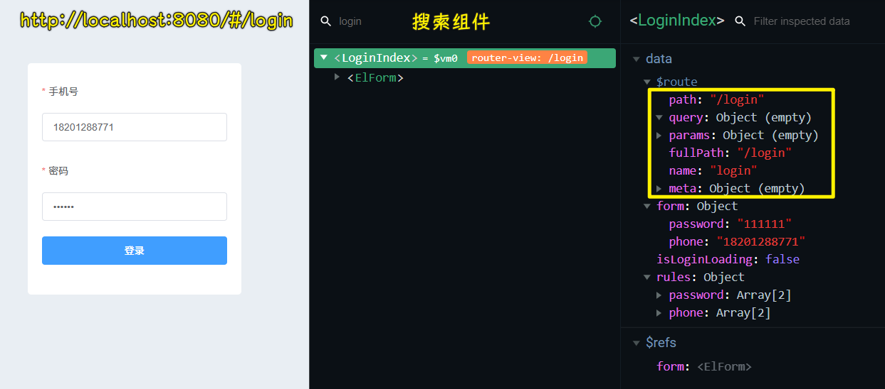

## ★展示当前登录用户信息

获取登录用户信息的接口测试成功之后 -> 用代码实现我们想要的效果

思路：

1. 在用户模块当中封装一个请求方法，通`header`配置用户请求相关的数据
2. 在`app-header`组件里边调用请求方法，改变`data`，用开发者工具测试`data`是否已经改变了 -> 确认无误后，就在`template`里边写模板
3. 有用户有头像，有的则没有 -> 默认头像处理（用`require`，可以使用`@`别名）

获取用户信息接口：

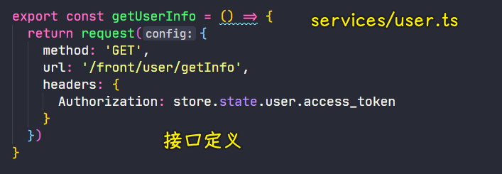

展示登录用户信息：

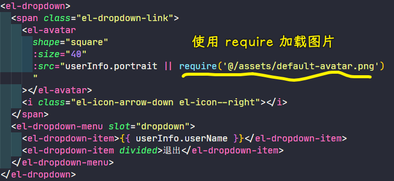

> 没有头像，`userInfo.portrait`是`null` -> 给默认头像
> 
> `:src="userInfo.portrait || '../../assets/default-avatar.png'"`这样动态绑定的属性，获取图片信息是不行，你得调用`require`方法，把图片路径字符串作为一个参数传给它 -> 这样做才是有效的，把`require`当作是 JS 处理，这样才能把图片打包成`base64`

获取数据：

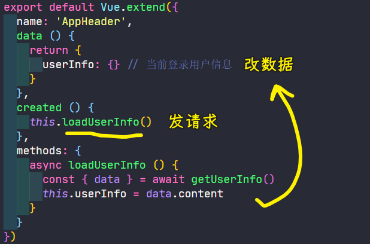

测试：

- 换个登录账号试试，不然其它账号不行，意味着代码写得不对……

💡：遗留问题：`token`过期，会让登录用户信息失效

## ★使用请求拦截器统一设置 Token

获取用户信息的接口，需要提供身份标识`token`，没用这个，你是拿不到用户数据的

问题：课程管理、用户管理等接口都需要我们提供`token`才能拿到数据，不然，会返回`401`，表示你咩有权限

我们期望的：需要提供`token`的接口，我们都需要自己写，让请求发送的时候自动添加`token`，类似`Postman`这样自动设置，而我们得自己用代码来设置

思路：使用`axios`提供的请求拦截器

文档：[axios/axios: Promise based HTTP client for the browser and node.js](https://github.com/axios/axios#interceptors)

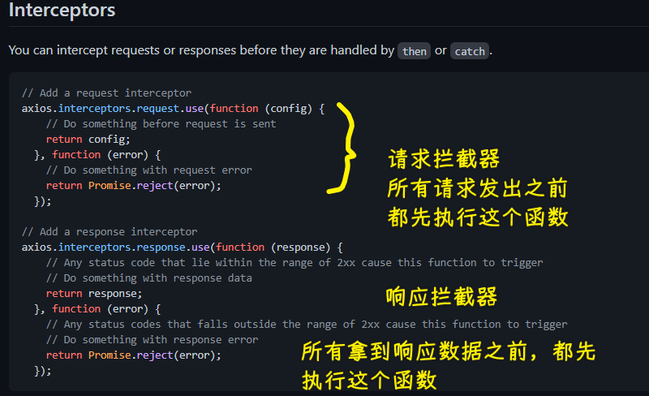

传给`use`的两个`callback`：

- 第一个：请求没有问题的情况会经过它 -> 正常情况下，请求都是没啥问题的，所以它会被常用到
- 第二个：请求本身出错则会经过它

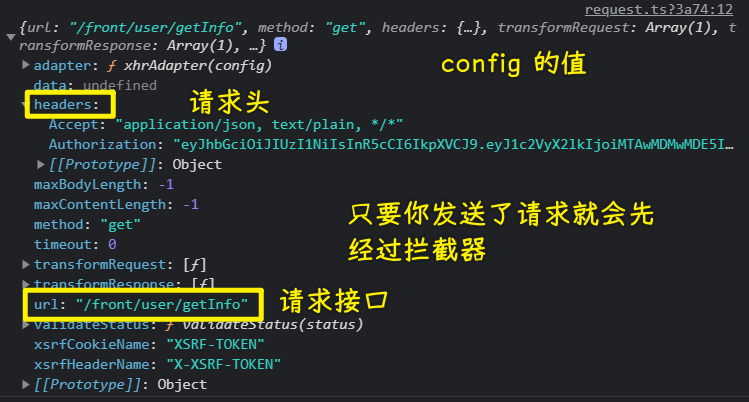

代码：

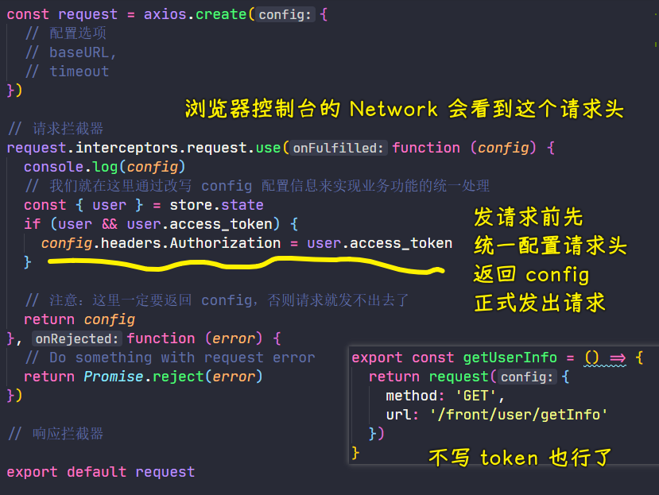

## ★用户退出

- `@click.native` -> 根节点元素触发事件
- `click`属性 -> 只有下拉菜单任何一个`item`被点击都会被触发

思路：把容器的`user`和本地存储的数据都给清空了

代码：

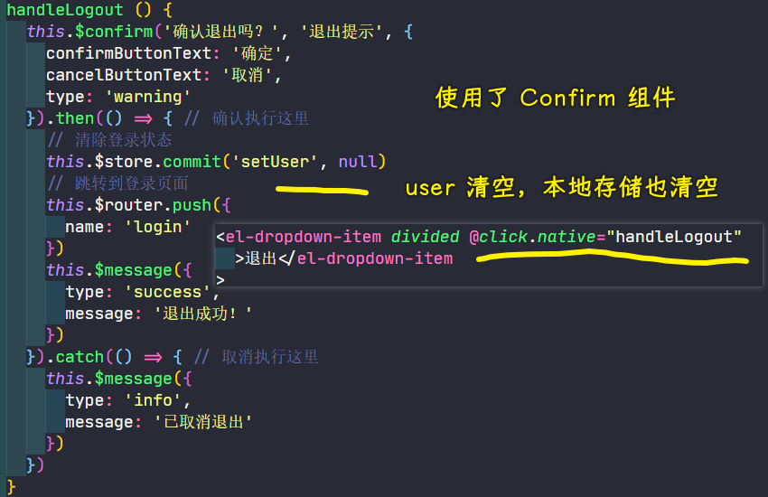

效果：

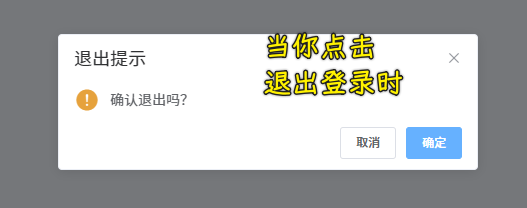