### ✍️ Tangxt ⏳ 2021-08-16 🏷️ Vue

# 06-8-身份认证-处理 Token 过期-概念介绍、分析响应拦截器、axios 错误处理、错误消息提示

## ★概念介绍

问题：关于 Token 过期

用户登录成功过后，我们收到了这么一个对象：

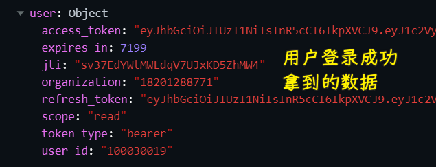

这个数据对象里边有一个`access_token`属性，我们透过这个属性去请求需要授权的接口，这样才能拿到对应的数据 -> 它表示用户的身份

然而，这个`token`它是有过期时间的，注意，这个过期时间是后端设置的，而前端是设置不了的

在这里后端默认设置的过期时间是`24`个小时，也就是说，一天以后你这个`token`就过期了，而这意味着`token`无效了，你也就无法利用这个`token`来获取数据了

> 我测试了一下 -> `express_in`的值是随机的（重新登录居然变成了`6205`），我也不太确定它的单位是不是`s`（或许是吧，如果是，那就是`1.5~2`小时了），当然，我只需要知道`token`是会失效的就好了，而且这个时间是比较短的！

如果你非得用这已经过期的`token`去请求，那么就会得到一个`401`的响应（无乱是`token`过期，还是验证失败都会返回`401`）

测试`token`过期 -> 无须等`24`小时，直接修改本地存储的`token`就好了

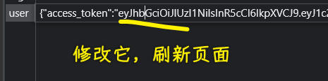

效果：

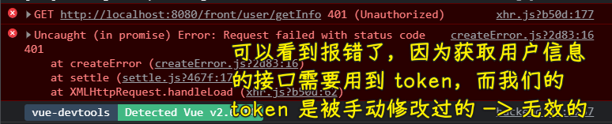

无效的`token`或过期的`token`都会受到`401`响应

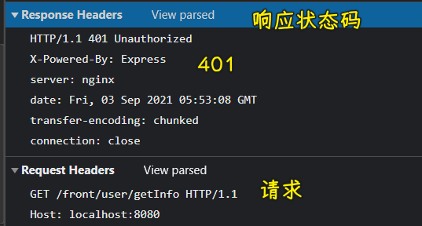

所以在这种情况下，我们该咋办呢？

最简单的处理方式就是 -> 遇到`401`让用户重新登录一下呗！

这样做是可以的，当然，我们是设置了`24`小时的过期时间 -> 但是，有些网站，它是`3`分钟、`5`分钟、`10`分钟这样`token`就过期了，过期了就叫用户登录，这样会**让用户频繁登录**的，而这显然用户体验很不好！

💡：能不能在`token`过期后，用户不用重新登录，也能解决`token`过期的问题呢？

💡：`access_token`、`expires_in`、`refresh_token`的作用？

1. 获取需要授权的接口数据
2. 设置`access_token`的过期时间
3. 刷新获取新的`access_token`

💡：为什么`access_token`要有过期时间以及为啥要把它设置的比较短？

为了安全 -> 它代表着用户的身份，一旦这个身份标识遭到了泄漏，那不怀好意的人就可以拿这个`access_token`来冒充用户的身份来进行一些操作了

设置过期时间以及设置得比较短，可以降低风险

💡：用户在访问网站期间，`access_token`过期了？

利用`refresh_token`来刷新获取一个新的`access_token`，而旧的过期的`token`也就没啥用了

获取了新的`token`，就可以进行后续的操作了

💡：获取新`access_token`的处理流程？

有两种姿势：

1. 在请求发起前拦截每个请求，判断`token`的有效时间是否已经过期了，若已过期，则将请求挂起，先刷新`token`后再继续请求
   1. 做法：`axios`拦截器、`express_in`、`refresh_token`
2. 不在请求前拦截，而是拦截返回后的数据。先发起请求，接口返回过期后，先刷新`token`，再进行一次重试
   1. 做法：过期的话，后端会返回`401`，判断这个码，然后再`refresh_token`

选择哪种方式呢？

姿势一：

- 优点：在请求前拦截，能节省请求、省流量
- 缺点：需要后端额外提供一个`token`过期时间的字段，使用了本地时间判断，若本地时间被篡改，特别是本地时间比服务器时间慢时，拦截就会失败

姿势二：

- 优点：不需额外的`token`过期字段，不需判断时间
- 缺点：会消耗多一次请求，耗流量

不管过期与否，先试一下呗！不行，那就`refresh`一下再搞呗！

---

所以选择哪种？

我们从中可以看到，姿势一、二的优缺点都是互补的，姿势一有校验失败的风险（本地时间被篡改时，当然，一般没有用户闲的蛋疼的去改本地时间），姿势二更简单粗暴，等知道服务器已经过期了再重试一次，只是会耗多一个请求，其实这个流量可以忽略不计

**选择姿势二来处理刷新`token`的操作** -> 推荐这种做法，因为它是绝对没有问题的，当然，你也可以私下尝试一下姿势一的做法！

---

以上就是关于`token`过期的一个基本逻辑了！

## ★分析响应拦截器

> 如何用姿势二处理`token`过期问题？

由于每一个需要授权的接口 -> 它都可能会返回`401`（`token`过期的缘故）

所以我们在这里最好是通过拦截器来对这些接口进行统一处理

定位到`utils/request.ts`，添加一个「响应拦截器」

如何添加呢？ -> 查看`axios`[文档](https://github.com/axios/axios#interceptors) 呗！

CRM 大法 -> 拷贝后：

1. 格式处理，去掉分号，无用注释
2. 把`axios`改为我们创建的`axios`实例`request`

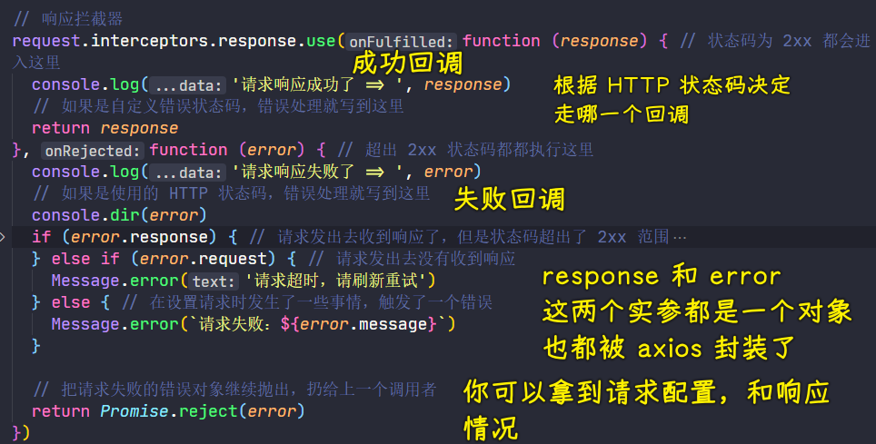

💡：响应拦截器的意义？

- 顾名思义 -> 收到响应后优先进入这个拦截器，经过拦截器后，才会真正走到发请求的那个响应里边 -> 就是这么一个流程哈！

💡：这`use`方法有两个函数，它们的作用都是啥？

注释已经说得很清楚了

- 所有 HTTP 状态码为 `2xx` 都会进入第一个函数`onFulfilled`
- 而出 `2xx` 状态码都都执行第二个函数`onRejected`

说白了，响应成功走第一个，响应失败走第二个呗！

话说，请求响应成功，传给第一个函数的参数`response`是啥？

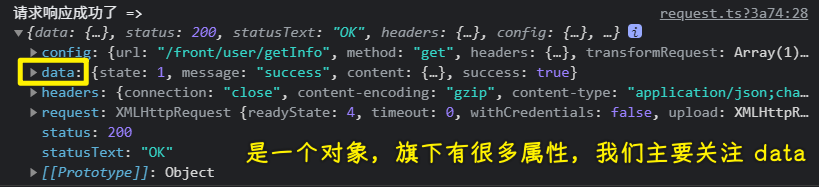

只要有请求就会有响应，有响应就会进入到这个响应拦截器，所以我们会看到代码的执行会经过这个拦截器

`response`的内容：

- `data`是我们真正获取的数据
- `config`是请求的配置对象，如请求地址是啥，请求方法是啥，请求头是啥，请求参数又是啥等……
- `headers`则是响应头
- `status`响应状态码
- `statusText`与状态码相对应的状态信息，如`200`就是`OK`

演示走失败的回调 -> 在`localStorage`里边把`access_token`改为无效的然后刷新页面就好了

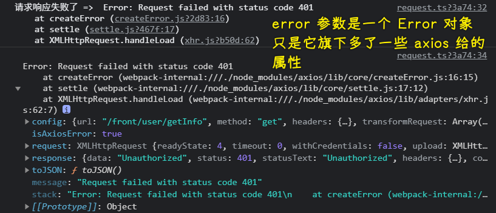

返回的是`401` -> 超出`2xx`范围，所以会走失败回调

这个`error`对象里边都是本次请求失败相关的错误对象

- `config`：本次失败的请求配置对象
- `isAxiosError`：为`true`，这是一个`Axios`错误
- `request`：发请求的对象`XMLHttpRequest`
- `response`：本次请求的响应对象 -> 很明显响应是失败的，所以会有`401`、`"Unauthorized"`等信息
- `message`：错误消息 -> `Promise`抛出的错误信息提示
- `stack`：子错误堆栈

💡：在实际开发中，后端返回的错误状态码有的是用自定义错误状态码，也就是把任何请求都当成是成功的，通过在响应体数据里边放一些自定义状态码给客户端去使用然后进行判断

面对这种情况，在第一个回调里边，你就得根据自定义错误状态码去作出相应的错误处理

总之，成功/失败不是绝对的放在第一个/第二个这样去处理的，你得根据项目的接口情况来进行处理！

简而言之，项目接口用的是 HTTP 状态码，那错误处理就写到失败回调

在上边的`log`里边，可以看到`getInfo`这个接口用的是 HTTP 状态码的！（之前的用户登录接口，像非法的手机后等用是`2xx`自定义状态码）

## ★`axios`错误处理

> 把 HTTP 相关的公共错误处理扔到失败回调里边去

怎么做呢？ -> 还是看文档的处理错误示例

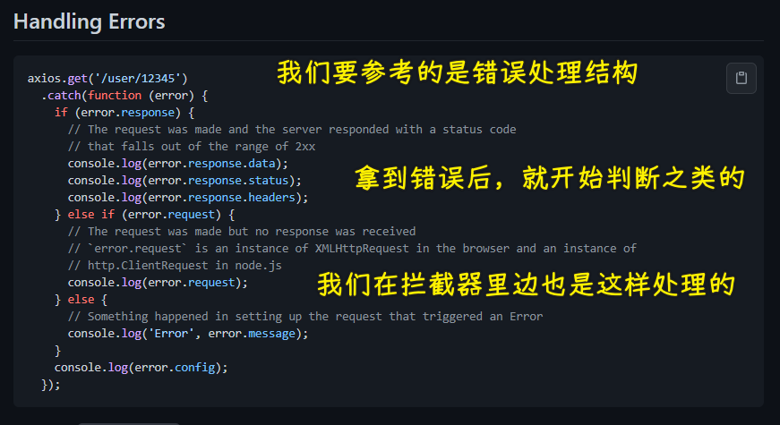

把这判断扔到错误回调里边去，你可以到它有三种不同的情况：

1. 请求发出去收到响应了，但是状态码超出了 `2xx` 范围 -> 拿到本次响应的「响应数据、响应状态码、响应头」
2. 请求发出去没有收到响应 -> 如果`error.response`不存在，那么看看`error.request`是否存在？ -> 请求超时、网络断开会出现这种情况
3. 在设置请求时发生了一些事情，触发了一个错误 -> 这种情况一般是未知的，所以直接给个消息提示框就好了

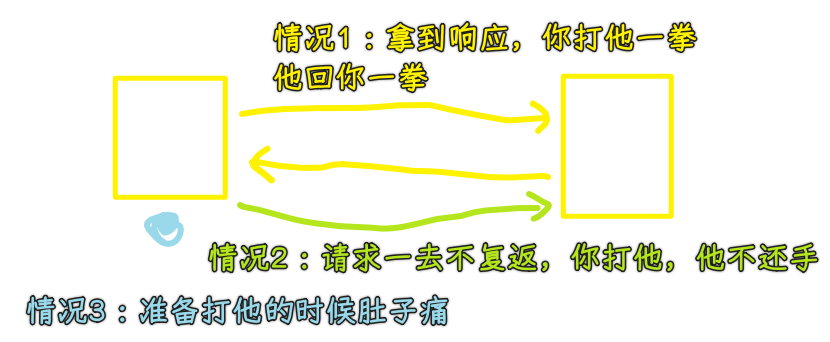

针对这三种情况，我们分别对这个`error`进行处理

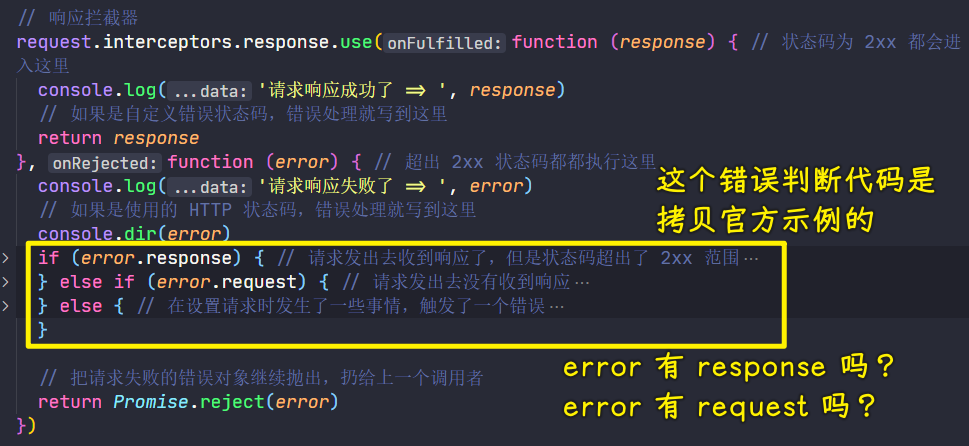

💡：这个错误回调的返回值`return Promise.reject(error)`？

这是在把请求失败的错误对象继续抛出，扔给上一个调用者，也就是真正发请求的那个地方还想拿到这个错误信息

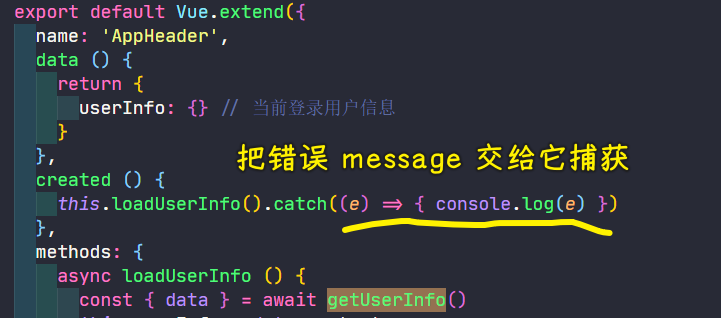

当然，这是默认写好的示例代码

--- 

从官方文档拿到基本的错误逻辑判断后，那我们下一步该在`if...else`的`{}`里边做些什么呢？

## ★错误消失提示

处理失败回调里边`if...else`的`{}`逻辑，先从简单的开始处理

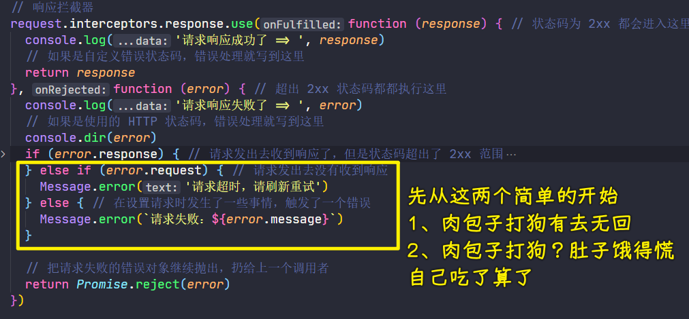

`error.response`为`true`的处理逻辑就比较多了，常见的 HTTP 相关错误如`400、401、403、404、500`，注意，这不是乱写的，而是后端与前端约定好的（也是官方约定的）：

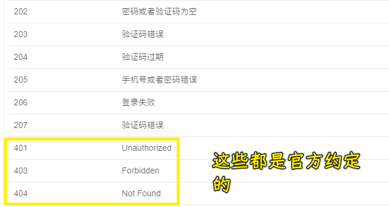

根据不同的错误，给出不同的消息提示 -> 让用户知道我现在到底怎么了，然后我应该怎么做？

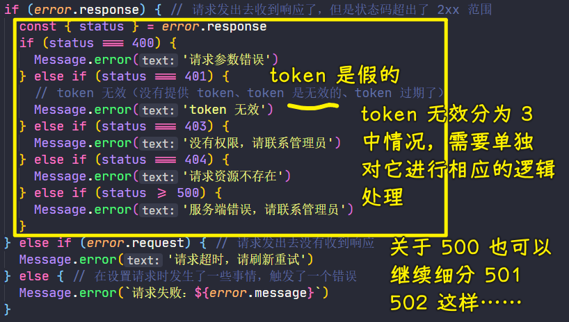

> 400 Bad Request -> 指出服务器不能或不会处理请求，因为它被认为是一个客户端错误（例如，错误的请求语法，无效的请求消息构造「 invalid request message framing」，或欺骗性的请求路由）。

💡：单独加载一个`Message`？

之前用的是`this.$message`，当然，这里的`this`是`Vue`实例哈！

而我们的`request.ts`可没有`Vue`实例

💡：HTTP response status codes？

响应状态码表示的信息 -> 在 HTTP 规范里边是有约定的！

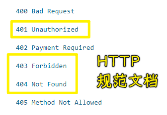

➹：[401 Unauthorized - HTTP - MDN](https://developer.mozilla.org/zh-CN/docs/Web/HTTP/Status/401)
