### ✍️ Tangxt ⏳ 2021-09-04 🏷️ Vue

# 06-9-身份认证-处理 Token 过期-实现基本流程逻辑、关于多次请求的问题、解决多次请求刷新 Token 问题、解决多次请求其它接口重试的问题

## ★实现基本流程逻辑

单独针对这个`401`搞事情

`401` -> 授权失败 -> 重新登录获取新的`token`

搞事情的基本流程（伪代码）：

1. 没有`refresh_token`（意味着没有登录用户） -> 直接跳到登录页重新登录
2. 有`refresh_token`
   1. 发请求获取新`token`失败了 -> 重新登录
   2. 成功了 -> 带着新的`token`重新发请求

💡：在`request.ts`里边这样：`import router from '@/router'`，是在干嘛呢？

我们需要使用路由重新跳转到登录页，而该文件是没有组件实例的，所有我们需要单独加载一个路由实例

这个`router`跟我们在组件中所使用的`this.$router`实际上是同一个东西，都是这个`router`文件里边创建的路由实例`new VueRouter({})`

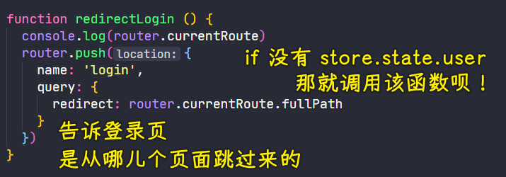

💡：请求`/front/user/refresh_token`这个接口？

数据怎么传？ -> `x-www-form-urlencoded` -> 在请求体里边 -> 需要用到`qs`

`refresh_token`可能会过期或无效，意味着该请求也有可能返回`401`

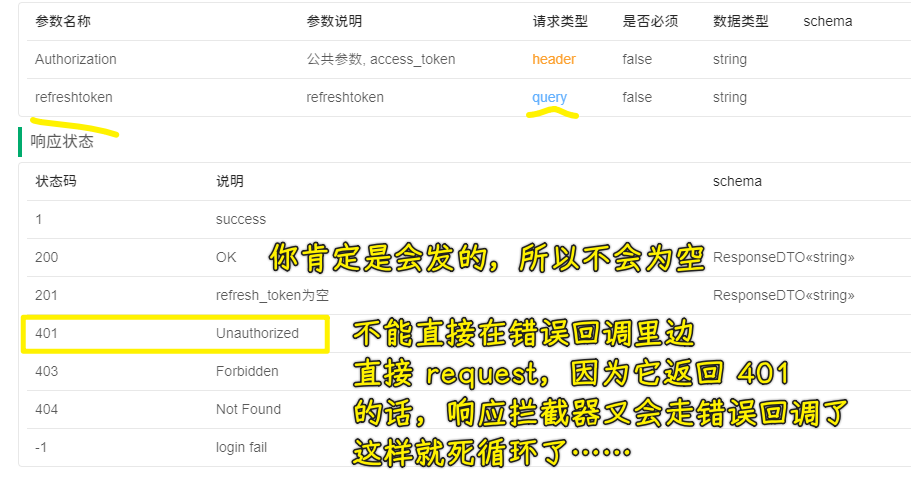

我们创建一个新的`axios`实例，该实例不是之前绑定了响应拦截器的`request`实例，所以你用新的`axios`实例去发是不会走响应拦截器的

当然，你也可以不用这样搞，可以自己在`401`这个逻辑做个判断……

注意：响应超出 `2xx`，`axios`实例默认会报错，当然，你可以配置一下`validateStatus`

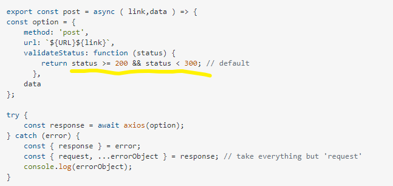

➹：[javascript - Axios handling errors - Stack Overflow](https://stackoverflow.com/questions/49967779/axios-handling-errors)

💡：请求`/front/user/refresh_token`这个接口所拿到的数据？

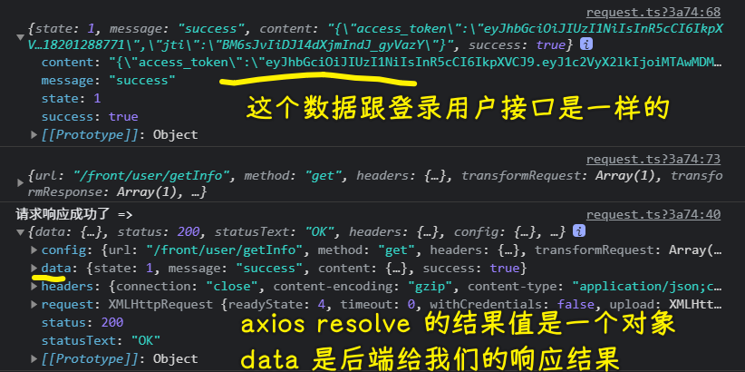

💡：`axios.create()()`？

第一个`()`给的是`axios`实例的全局默认配置（返回了一个函数，类似在固定一个参数），而第二个`()`是自定义的，你可以在这儿去传发请求的配置参数（返回的是一个`Promise`实例）

💡：整个流程大概是这样的？

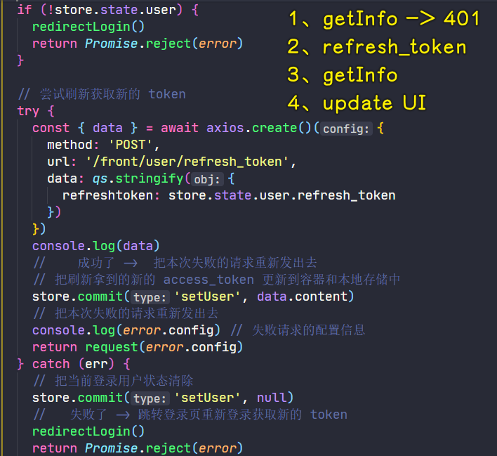

页面定位到`user`路由 -> 更改本地存储的`access_token`，让该`token`是无效的 -> 刷新页面 -> 页面会去获取用户信息`getInfo` -> 报错，`401` -> 响应拦截器拦截到它 -> 知道它是`401`：

1. 判断全局`user`是不是根本就没有？ -> 没有意味着没有`refresh_token` -> 重新登录就完事儿了
2. 有`refresh_token` -> 创建一个新的`axios`实例，带着这个值请求`/front/user/refresh_token`这个接口
   1. 如果响应`401`，就会被`catch`到，把全局`user`清空 -> 重新登录就完事儿了
   2. 如果响应成功，那就把拿到的`data.content`赋值给全局的`user`，使用`request(error.config)`重新发送第一次`getInfo`的请求并把它的返回值`return`出去，也就是交个发请求的那个地方（`config`就是你给`request`传的那些配置，当然，这个`error.config`会更全） -> 由于我们对`request`设置了请求拦截器，在拦截的时候会重新设置`config.headers.Authorization`，这时的`user.access_token`是新鲜的（刚刚重新获取的）

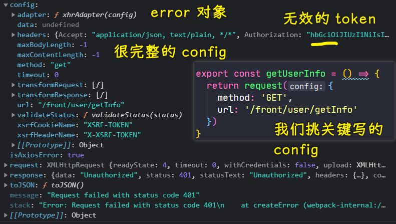

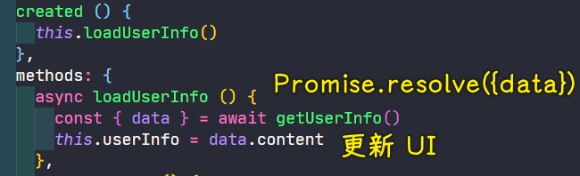

面对`token`在很短时间内就过期的问题，我们可以不用重新登录，就能一直保持登录状态了！当然，`refresh_token`也是会有过期时间的，不然，岂不是一直自动更新的本地的`user`信息？

> 记住登录用户`10`天，是不是在说`refresh_token`超过`10`天就过期了呢？可是全局`user`并没有一个关于`refresh_token`过期的字段，即便有，我们每次请求`refresh_token`都会重置它的过期时间吧！如`access_token`是`2`天，`refresh_token`是`3`天，两天已过，`access_token`刷新，而`refresh_token`又会重新刷新 -> 项目里边并咩有提到`Cookie`

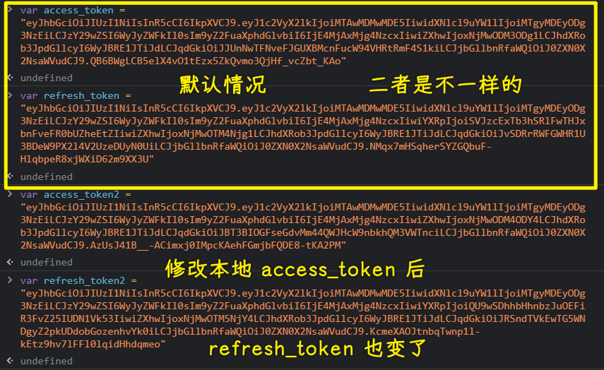

➹：[session 、cookie 和 token 三者的关系和区别 · Front-end-handbook](https://wuch886.gitbooks.io/front-end-handbook/content/session-cookiehe-token-san-zhe-de-guan-xi-he-qu-bie.html)

➹：[cookie,token 验证的区别 - 简书](https://www.jianshu.com/p/c33f5777c2eb)

➹：[简单聊一聊 Cookie、Session、Token、JWT 的区别和作用 - SegmentFault 思否](https://segmentfault.com/a/1190000021810849)

💡：无痛刷新？

在`token`过期的情况下，重新获取`token`（其实是重新获取登录信息，`/front/user/refresh_token`这个接口是在利用`refresh_token`重新获取登录信息） -> 这个过程用户是感知不到的，背后偷偷摸摸的自动发送了请求 -> 所以这是无痛的

---

以上就是处理`token`过期的一个基本流程，但这还不完美，还有一些小问题！

## ★关于多次请求的问题

目前的代码：一个请求没有问题

但同一时间如果有多个请求都`401`，那就有问题了！ -> 请求刷新多次`token`就会有问题！

💡：问题复现

目前的应用，请求的接口需要授权的只有一个，那就是`getInfo`

定位到`app-header.vue`：

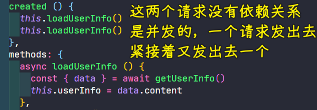

把本地`access_token`改成错的，刷新页面，直接跳到登录页去了：

``` md
http://localhost:8080/#/login?redirect=%2Fuser
```

检查网络请求日志：

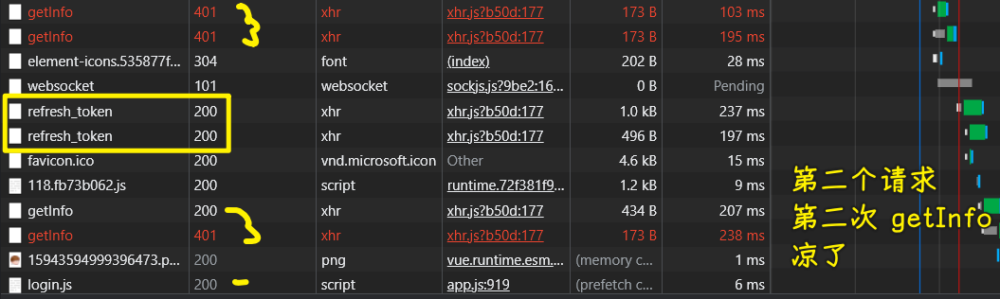

为啥会这样呢？

导致这样的问题：

1. 同一时间有多次并发请求，在`token`无效的情况下，会出现多次刷新`token`的情况
2. 即便出现多次刷新也没事，可问题是这失败了呀！

原因：`refresh_token`只能使用一次

第一次用的`refresh_token`假设为`123`，那这是 ok 的！可第二次用的`refresh_token`还是`123`，那就不 ok 了！


`/front/user/refresh_token`这个接口无论成功与否，都返回`200`，这是通过自定义姿势返回的，所以`try...catch`是没法捕获到`token`刷新失败的问题的！

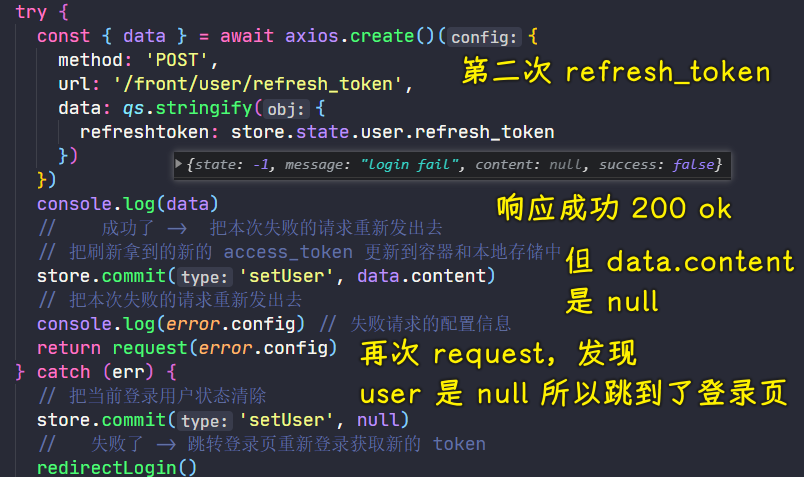

总之，`/front/user/refresh_token`失败了，并咩有使用标准的 HTTP 状态码，虽然外表成功，但数据是失败的！

## ★解决多次请求刷新 Token 问题

💡：改造这个代码？

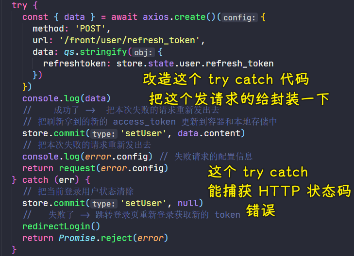

不用`try...catch`了，因为`/front/user/refresh_token`这个接口的请求无法捕获，毕竟它不管成功与否都是响应`200 ok`的！

``` js
function refreshToken () {
  return axios.create()({
    method: 'POST',
    url: '/front/user/refresh_token',
    data: qs.stringify({
      // refresh_token 只能使用 1 次
      refreshtoken: store.state.user.refresh_token
    })
  })
}
```

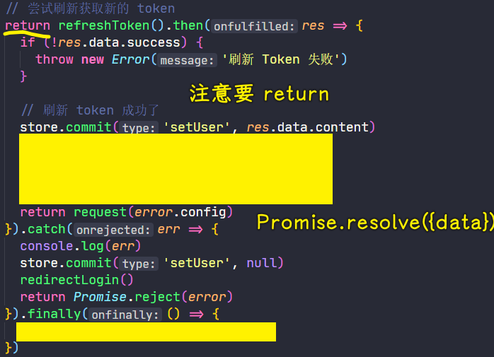

代码改造后，先确保原先只发送一次`getInfo`请求是 ok 的，再去测试同时发送多个请求
