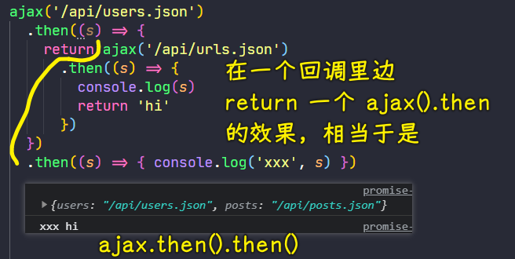
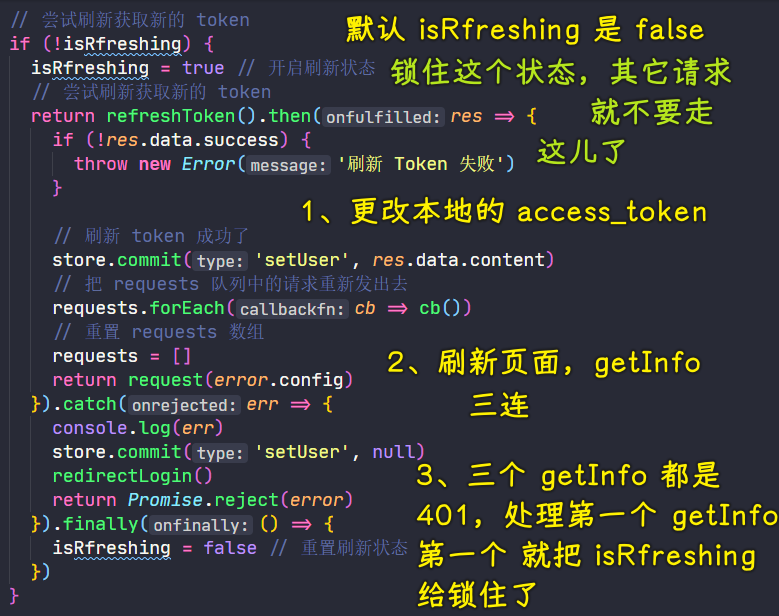
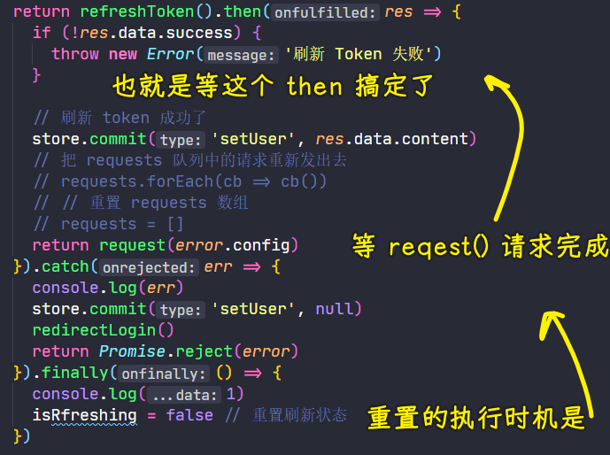
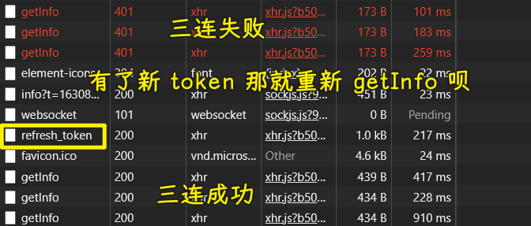
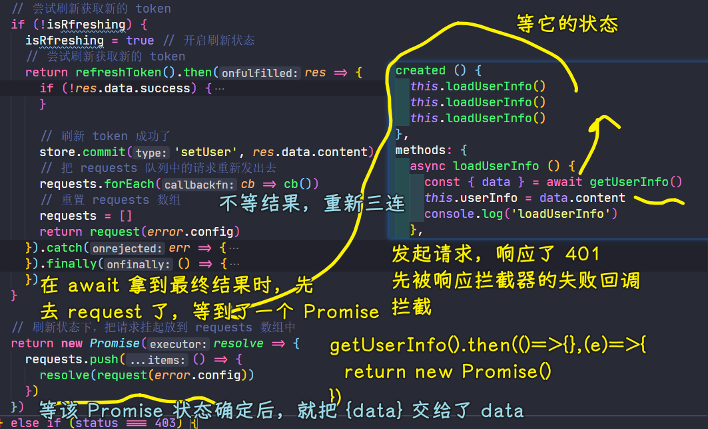
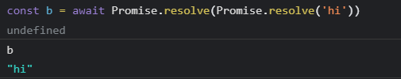

### ✍️ Tangxt ⏳ 2021-09-04 🏷️ Vue

# 06-9-身份认证-处理 Token 过期-实现基本流程逻辑、关于多次请求的问题、解决多次请求刷新 Token 问题、解决多次请求其它接口重试的问题

## ★实现基本流程逻辑

单独针对这个`401`搞事情

`401` -> 授权失败 -> 重新登录获取新的`token`

搞事情的基本流程（伪代码）：

1. 没有`refresh_token`（意味着没有登录用户） -> 直接跳到登录页重新登录
2. 有`refresh_token`
   1. 发请求获取新`token`失败了 -> 重新登录
   2. 成功了 -> 带着新的`token`重新发请求

💡：在`request.ts`里边这样：`import router from '@/router'`，是在干嘛呢？

我们需要使用路由重新跳转到登录页，而该文件是没有组件实例的，所有我们需要单独加载一个路由实例

这个`router`跟我们在组件中所使用的`this.$router`实际上是同一个东西，都是这个`router`文件里边创建的路由实例`new VueRouter({})`


💡：请求`/front/user/refresh_token`这个接口？

数据怎么传？ -> `x-www-form-urlencoded` -> 在请求体里边 -> 需要用到`qs`

`refresh_token`可能会过期或无效，意味着该请求也有可能返回`401`


我们创建一个新的`axios`实例，该实例不是之前绑定了响应拦截器的`request`实例，所以你用新的`axios`实例去发是不会走响应拦截器的

当然，你也可以不用这样搞，可以自己在`401`这个逻辑做个判断……

注意：响应超出 `2xx`，`axios`实例默认会报错，当然，你可以配置一下`validateStatus`


➹：[javascript - Axios handling errors - Stack Overflow](https://stackoverflow.com/questions/49967779/axios-handling-errors)

💡：请求`/front/user/refresh_token`这个接口所拿到的数据？


💡：`axios.create()()`？

第一个`()`给的是`axios`实例的全局默认配置（返回了一个函数，类似在固定一个参数），而第二个`()`是自定义的，你可以在这儿去传发请求的配置参数（返回的是一个`Promise`实例）

💡：整个流程大概是这样的？


页面定位到`user`路由 -> 更改本地存储的`access_token`，让该`token`是无效的 -> 刷新页面 -> 页面会去获取用户信息`getInfo` -> 报错，`401` -> 响应拦截器拦截到它 -> 知道它是`401`：

1. 判断全局`user`是不是根本就没有？ -> 没有意味着没有`refresh_token` -> 重新登录就完事儿了
2. 有`refresh_token` -> 创建一个新的`axios`实例，带着这个值请求`/front/user/refresh_token`这个接口
   1. 如果响应`401`，就会被`catch`到，把全局`user`清空 -> 重新登录就完事儿了
   2. 如果响应成功，那就把拿到的`data.content`赋值给全局的`user`，使用`request(error.config)`重新发送第一次`getInfo`的请求并把它的返回值`return`出去，也就是交个发请求的那个地方（`config`就是你给`request`传的那些配置，当然，这个`error.config`会更全） -> 由于我们对`request`设置了请求拦截器，在拦截的时候会重新设置`config.headers.Authorization`，这时的`user.access_token`是新鲜的（刚刚重新获取的）


面对`token`在很短时间内就过期的问题，我们可以不用重新登录，就能一直保持登录状态了！当然，`refresh_token`也是会有过期时间的，不然，岂不是一直自动更新的本地的`user`信息？

> 记住登录用户`10`天，是不是在说`refresh_token`超过`10`天就过期了呢？可是全局`user`并没有一个关于`refresh_token`过期的字段，即便有，我们每次请求`refresh_token`都会重置它的过期时间吧！如`access_token`是`2`天，`refresh_token`是`3`天，两天已过，`access_token`刷新，而`refresh_token`又会重新刷新 -> 项目里边并咩有提到`Cookie`


➹：[session 、cookie 和 token 三者的关系和区别 · Front-end-handbook](https://wuch886.gitbooks.io/front-end-handbook/content/session-cookiehe-token-san-zhe-de-guan-xi-he-qu-bie.html)

➹：[cookie,token 验证的区别 - 简书](https://www.jianshu.com/p/c33f5777c2eb)

➹：[简单聊一聊 Cookie、Session、Token、JWT 的区别和作用 - SegmentFault 思否](https://segmentfault.com/a/1190000021810849)

💡：无痛刷新？

在`token`过期的情况下，重新获取`token`（其实是重新获取登录信息，`/front/user/refresh_token`这个接口是在利用`refresh_token`重新获取登录信息） -> 这个过程用户是感知不到的，背后偷偷摸摸的自动发送了请求 -> 所以这是无痛的

---

以上就是处理`token`过期的一个基本流程，但这还不完美，还有一些小问题！

## ★关于多次请求的问题

目前的代码：一个请求没有问题

但同一时间如果有多个请求都`401`，那就有问题了！ -> 请求刷新多次`token`就会有问题！

💡：问题复现

目前的应用，请求的接口需要授权的只有一个，那就是`getInfo`

定位到`app-header.vue`：


把本地`access_token`改成错的，刷新页面，直接跳到登录页去了：

``` md
http://localhost:8080/#/login?redirect=%2Fuser
```

检查网络请求日志：


为啥会这样呢？

导致这样的问题：

1. 同一时间有多次并发请求，在`token`无效的情况下，会出现多次刷新`token`的情况
2. 即便出现多次刷新也没事，可问题是这失败了呀！

原因：`refresh_token`只能使用一次

第一次用的`refresh_token`假设为`123`，那这是 ok 的！可第二次用的`refresh_token`还是`123`，那就不 ok 了！


`/front/user/refresh_token`这个接口无论成功与否，都返回`200`，这是通过自定义姿势返回的，所以`try...catch`是没法捕获到`token`刷新失败的问题的！


总之，`/front/user/refresh_token`失败了，并咩有使用标准的 HTTP 状态码，虽然外表成功，但数据是失败的！

## ★解决多次请求刷新 Token 问题

💡：改造这个代码？


不用`try...catch`了，因为`/front/user/refresh_token`这个接口的请求无法捕获，毕竟它不管成功与否都是响应`200 ok`的！

所以我们直接上`then`了

``` js
function refreshToken () {
  return axios.create()({
    method: 'POST',
    url: '/front/user/refresh_token',
    data: qs.stringify({
      // refresh_token 只能使用 1 次
      refreshtoken: store.state.user.refresh_token
    })
  })
}
```


> 用`return`返回在失败回调里边进行的`getInfo`请求，`request()`返回一个`Promise`实例，该实例的状态是成功的就会被`await`等到结果，如果是失败的，那就会被调用`loadUserInfo`的`catch`方法所捕获到！



代码改造后，先确保原先只发送一次`getInfo`请求是 ok 的，再去测试同时发送多个请求

💡：多个请求的逻辑？

定义一个`isRfreshing`状态，用来控制刷新 `token` 的状态




按自己已有的理解：

1. 三个`getInfo`发出去了，为什么一个锁住了，另外两个就不执行了呢？难道 JS 不是单线程的吗？



`refreshToken().then()`的同步代码都会被执行掉，意味着本次的失败回调执行完了，`return`了一个目前还不明确是什么状态的`Promise`，而`finally`此时是还未执行的，因为我们在等`refreshToken`的结果

所以，第二个和第三个`getInfo`，在走失败的回调的时候，因为`isRfreshing`还是锁住的状态了，所以失败回调就直接返回了，意味着这俩兄弟响应拦截已经结束了

---

👇：把漏掉的两次失败请求`getInfo`也给重新 发出去，也就是也得把漏掉的两次`refresh_token`给补上！

## ★解决多次请求其它接口重试的问题

要实现的效果：

1. 三连`getInfo`报 `401`，都被响应拦截器给拦截了，本着谁请求完成谁先执行失败回调执行，第一个处理的会锁住`isRfreshing`，其余的还未等到解锁就结束了响应拦截器的失败回调的执行
2. 我们要做的是让三连失败的`getInfo`，在刷新了`token`后，重新来一次三连成功请求



在刷新`token`期间，其它请求接口先暂时挂起来先！

做法：

1. 定义`requests`：`let requests: any[] = []` -> 存储刷新 `token` 期间过来的 `401` 请求
2. `401`处理逻辑的返回值是一个`Promise`实例，之前的测试例子是三连`getInfo`，有一个`getInfo`负责刷新`token`，其余两个则返回两个什么异步任务都没干的承诺，当那个负责刷新`token`的成功了，就会遍历`requests`数组，把拿到的一个函数元素都给执行了，这些函数的执行意味着那些挂起的请求任务重新开始发请求了，而那个`request(error.config)`（一个`Promise`实例）也会作为`resolve`传给那个在`app-header`里边`await`等到的结果

代码：



我们想要让在刷新`token`期间过来的请求，在`token`刷新完成后，重新再发送一次…… -> 重新发时，是先发后两次，最后再发第一次！

注意：别忘了把`requests`给清空了，不然，那些失败请求就会累积很多了！

对`await`的认识：`await Promise.resolve(request(error.config))` -> `Promise.resolve(Promise.resolve('hi')) // Promise {<fulfilled>: "hi"}`



在`Promise.resolve`的源码里边，如果传给`resolve`的是`Promise`实例，那么就返回这个实例，`await`的返回值是成功`Promise`的`fulfilled`值

所以你可以近似这样看待：`await Promise.resolve(request(error.config)) <=> await request(error.config)`

