### ✍️ Tangxt ⏳ 2021-11-28 🏷️ 职业发展

# 01-概述、就业方向、公司组织架构、职业发展方向、面试流程

> 以下都是就业须知

### <mark>1）有什么类型的项目？</mark>

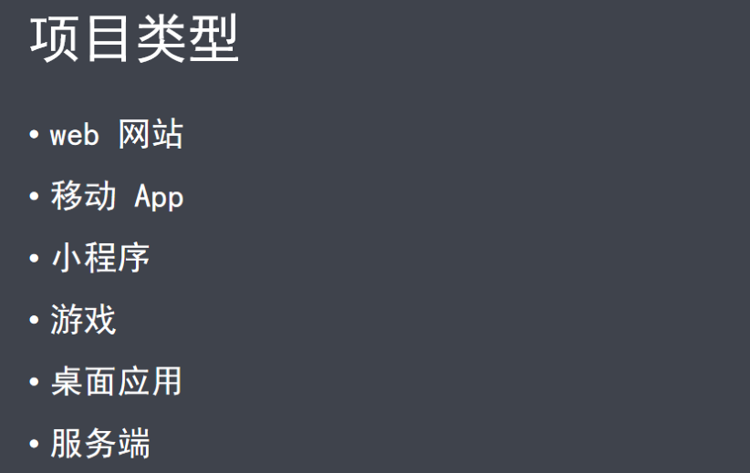

### <mark>2）求职时，你可以选择的行业方向？</mark>

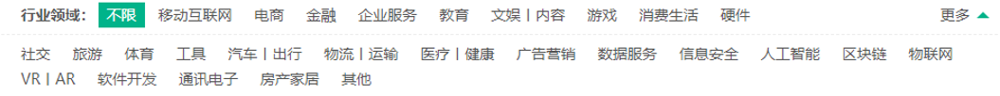

不同的行业领域里边，所做的项目内容也会有所不同：

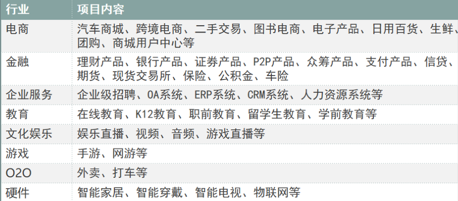

> 确定行业方向 -> 根据这个行业要做的项目内容 -> 针对性地学习有关这个项目内容的相关技术

➹：[拉钩招聘](https://www.lagou.com/wn/jobs?px=new&cl=false&fromSearch=true&labelWords=sug&suginput=web%20%E5%89%8D%E7%AB%AF&kd=web%20%E5%89%8D%E7%AB%AF&city=%E5%B9%BF%E5%B7%9E&pn=1)

### <mark>3）城市人才需求量</mark>

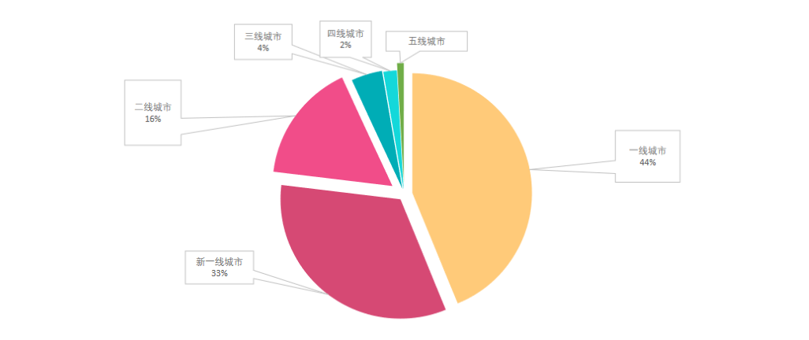

> 去岗位需求量多的地方，比如北上广深杭 -> 这样才会有更多的面试机会

### <mark>4）公司组织架构</mark>

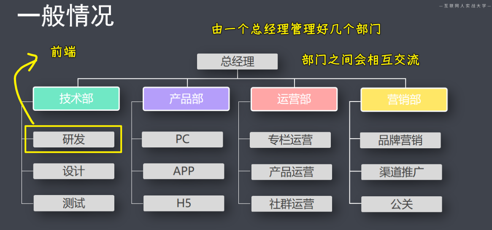

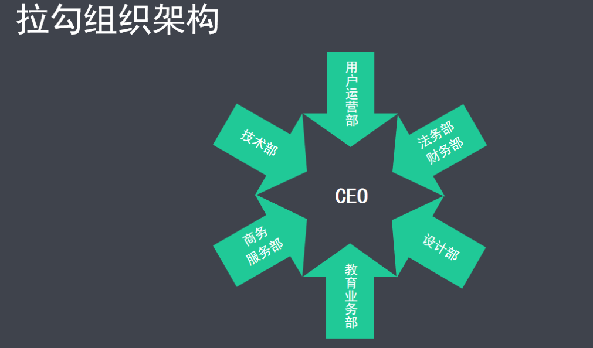

### <mark>5）你的职业发展方向</mark>

#### <mark>1、资深技术路线</mark>

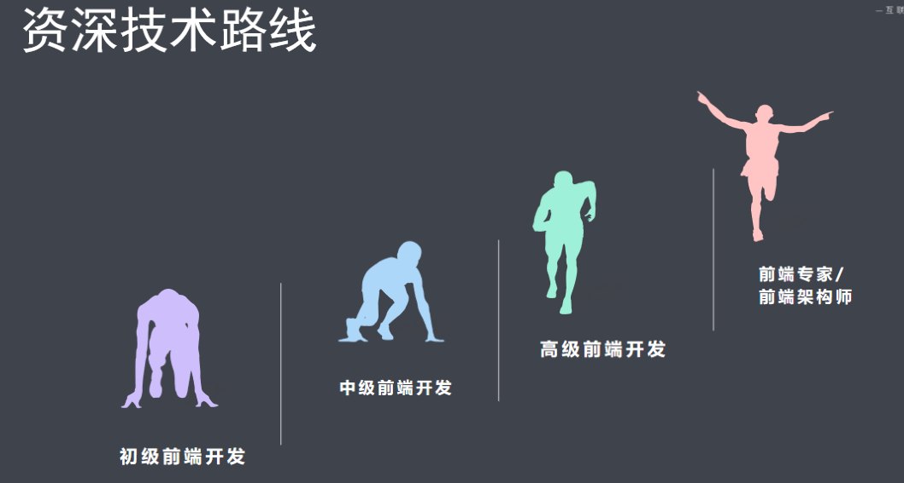

初级：

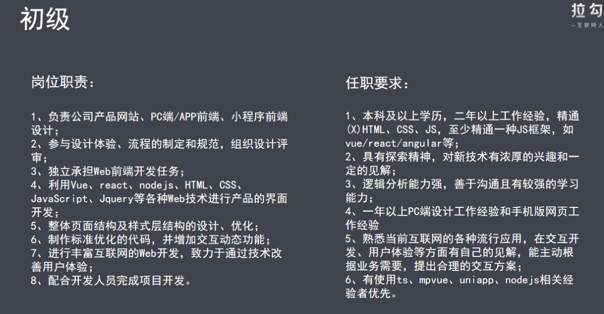

> 主要是写前端页面（PC 页面、移动端页面、小程序端页面），会一种前端框架（Vue or React） -> 有加分项最后

中级：

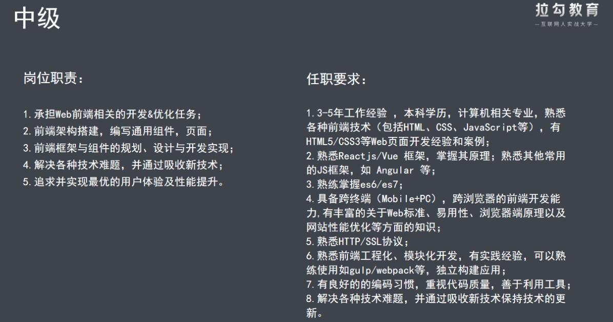

> 框架原理深入、前端工程化、模块化开发、网站性能优化、会写组件库

高级：

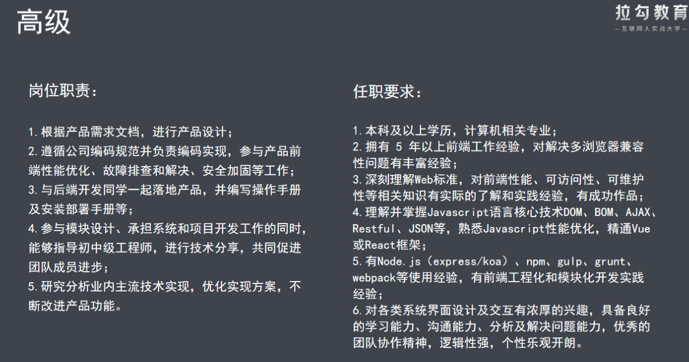

> 与产品经理、后端开发人员打交道、派发任务给初中级程序员、完成整个项目的骨架搭建等 -> 技术 leader

专家：

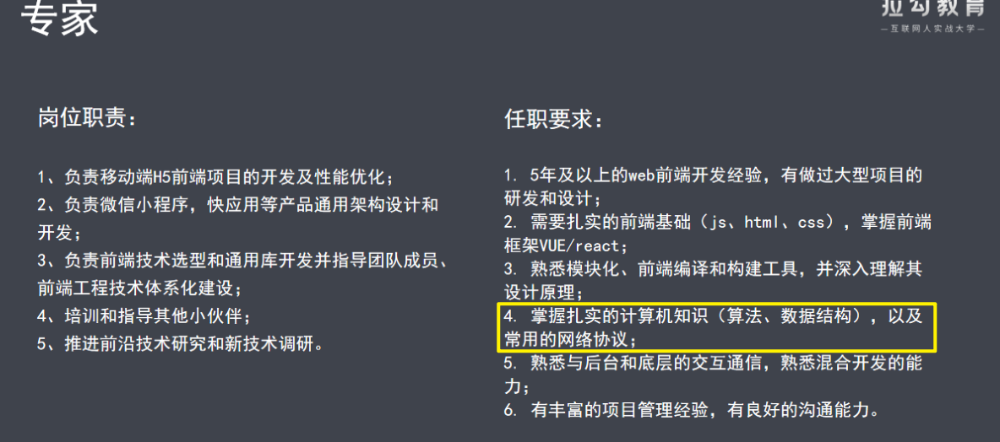

> 基本上，在某个行业领域的前端方向上，该踩的坑都踩了！不该踩的也踩了！

#### <mark>2、管理层路线</mark>

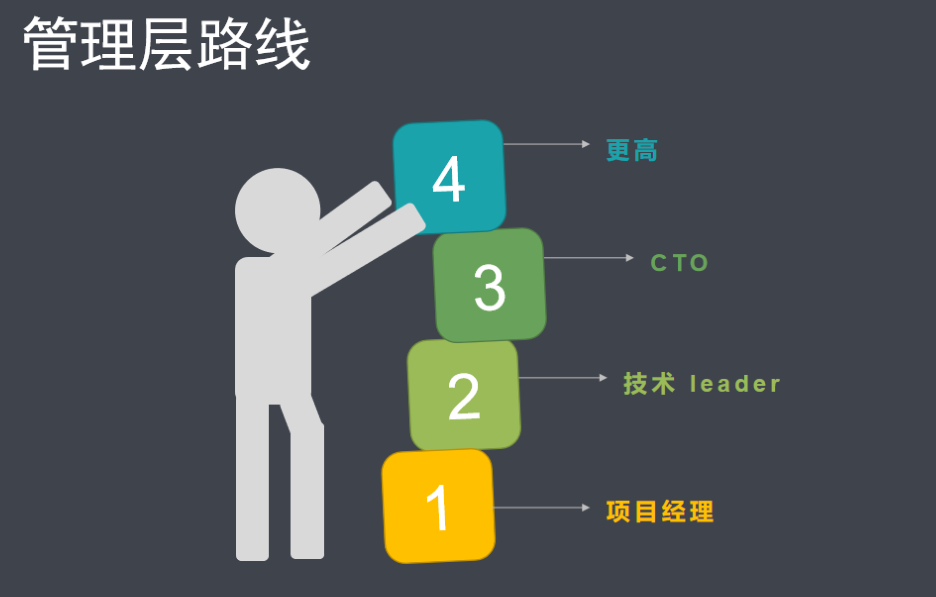

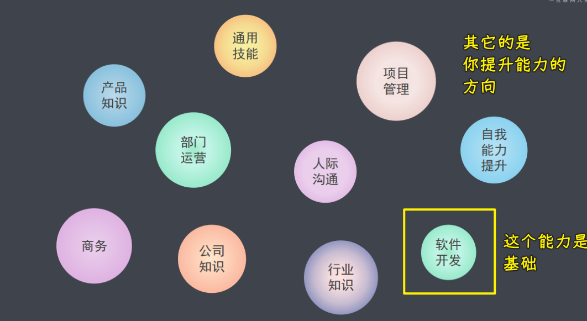

### <mark>6）面试流程</mark>

> 了解整个面试流程，这样我们才能针对性的做好准备工作

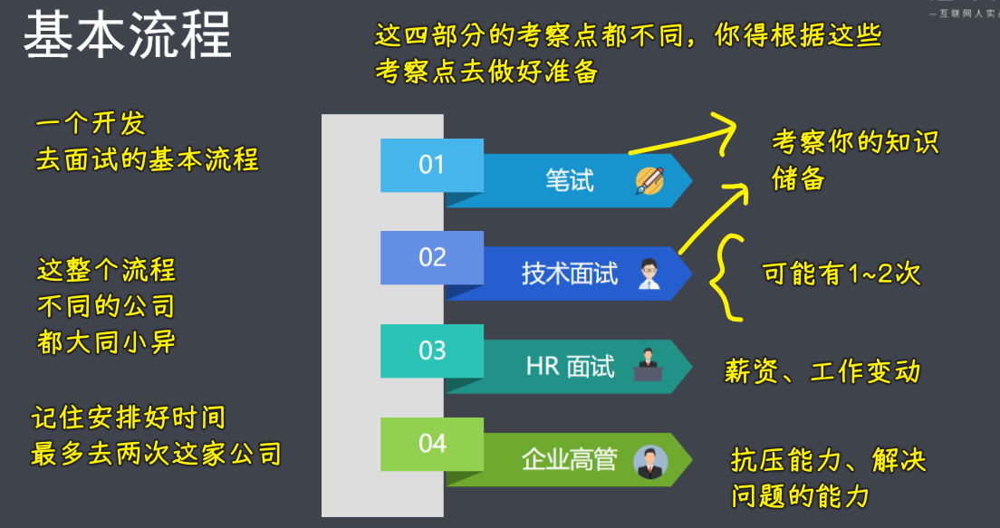

面试案例：

> 不要小看任何一次面试，请做好准备！

💡：以进入京东，提高面试率为中心论点

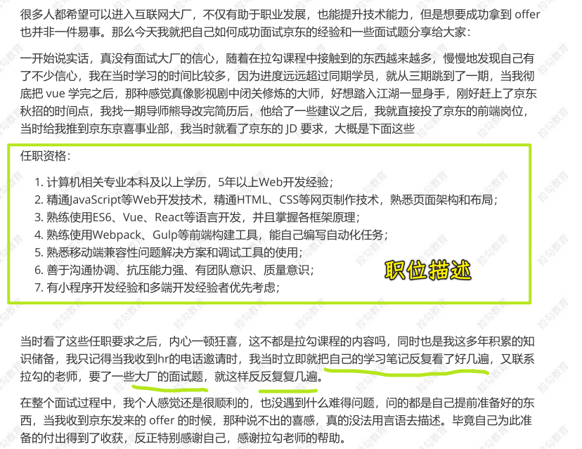

💡：罗列京东前端工程师需要具备哪些技术

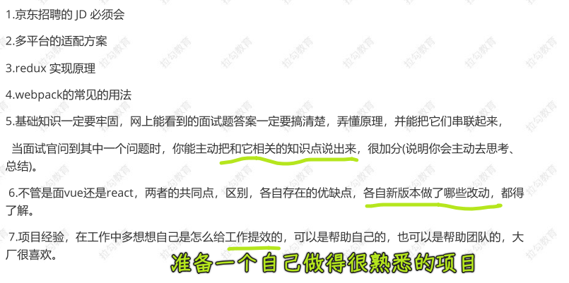

💡：罗列进入京东必考的面试题（最好附有答案）

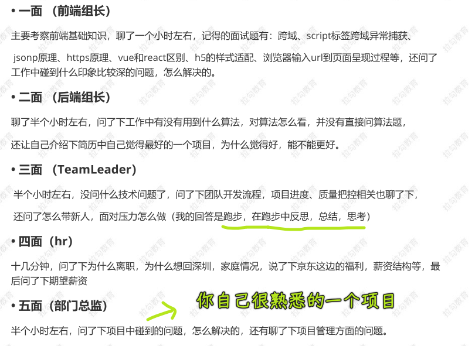

💡：经验分享

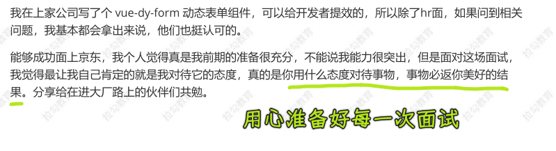

➹：[nandehutuzn/vue-dy-form: Vue 支持双向绑定的动态表单](https://github.com/nandehutuzn/vue-dy-form)

➹：[前端新贵 - 张宁-个人博客](https://lbjning.com/frontend/)
